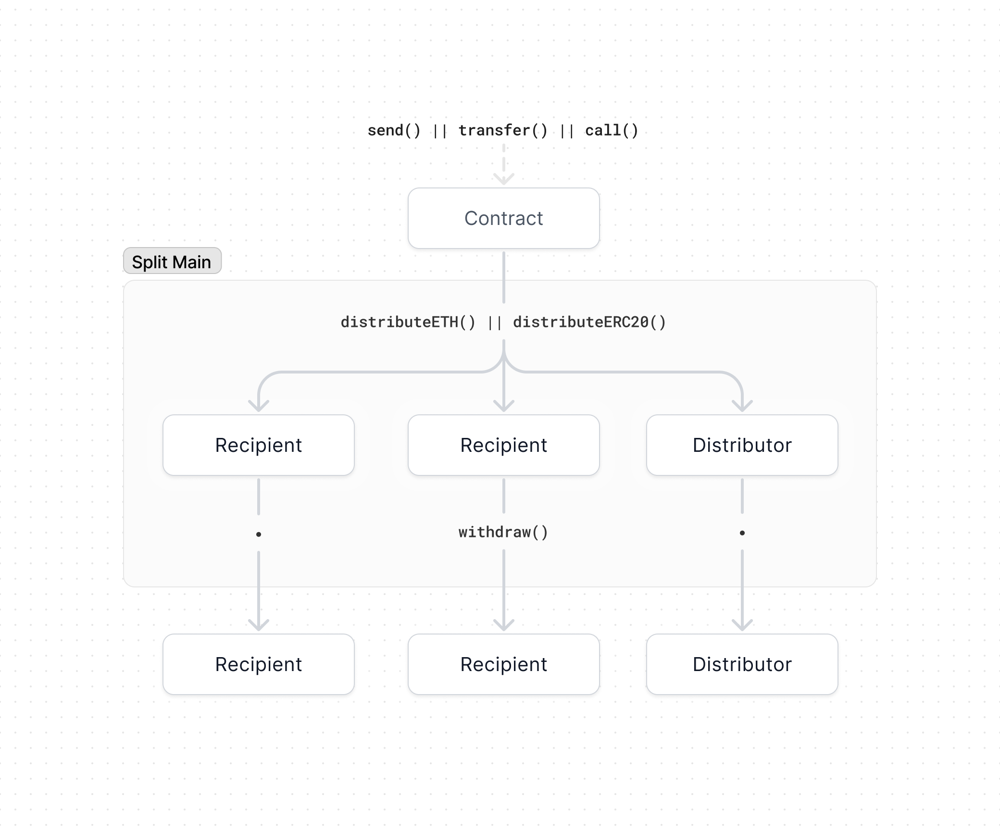

# Contracts

This section is broken into two categories.

- **Core contracts:** these are the smart contract building blocks upon which
  all payment flows are built. There are currently three core contracts: Split,
  Waterfall, and Vesting.
- **Templates**: these are pre-built payment flows that stack multiple core
  contracts together. These templates are supported natively within the app
  since they were built by the Splits team, however, you can easily create your
  own templates by stacking the core contacts together.

## Flow of funds

We recommend reading the [flow of funds](/flow) page if you haven't already. The
below diagram shows the different methods for moving funds through the system.

1. ETH and ERC20 tokens flow into the contract via `send`, `transfer`, or `call`
   and the contract's balance increases
2. Once a contract has a positive balance, anyone can call `distributeETH` or
   `distributeERC20` and earn the distributor fee
3. Anyone can call `withdraw` at anytime for any account, thereby withdrawing
   that account's balance in SplitMain
