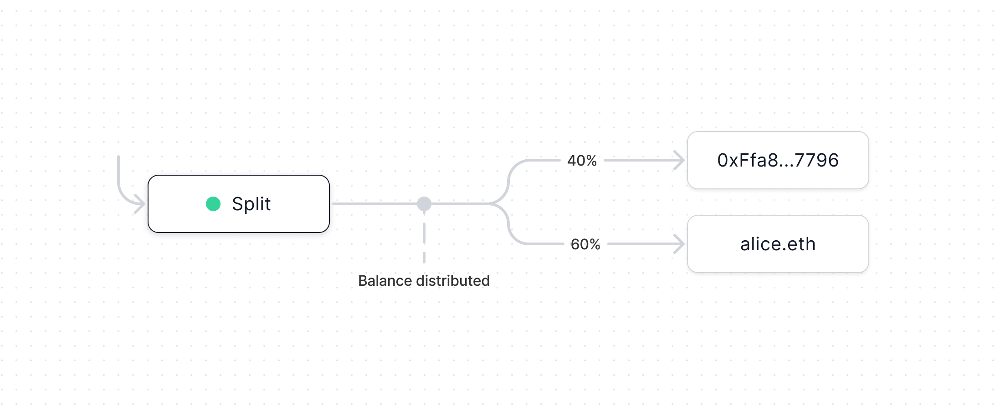

import { Toggle } from '../../../components/toggle'
import { Tab, Tabs } from 'nextra-theme-docs'

# Split

A Split is a payable smart contract that distributes all ETH & ERC20 tokens it
receives among recipients according to pre-set ownership percentages.

You can also read the contracts on
[GitHub](https://github.com/0xSplits/splits-contracts) or get started by
installing the [SDK](/sdk-info/overview).

## Flow of funds

## How it works

## Addresses

<Tabs items={['Mainnets', 'Testnets']}>

<Tab>

<Toggle title="Ethereum – 1">

| Contract    | Address                                                                                                                      |
| :---------- | :--------------------------------------------------------------------------------------------------------------------------- |
| SplitMain   | [`0x2ed6c4B5dA6378c7897AC67Ba9e43102Feb694EE`](https://etherscan.io/address/0x2ed6c4B5dA6378c7897AC67Ba9e43102Feb694EE#code) |
| SplitWallet | [`0xd94c0ce4f8eefa4ebf44bf6665688edeef213b33`](https://etherscan.io/address/0xd94c0ce4f8eefa4ebf44bf6665688edeef213b33#code) |

</Toggle>

<Toggle title="Optimism – 10">

| Contract    | Address                                                                                                                                 |
| :---------- | :-------------------------------------------------------------------------------------------------------------------------------------- |
| SplitMain   | [`0x2ed6c4B5dA6378c7897AC67Ba9e43102Feb694EE`](https://optimistic.etherscan.io/address/0x2ed6c4B5dA6378c7897AC67Ba9e43102Feb694EE#code) |
| SplitWallet | [`0xd94c0ce4f8eefa4ebf44bf6665688edeef213b33`](https://optimistic.etherscan.io/address/0xd94c0ce4f8eefa4ebf44bf6665688edeef213b33#code) |

</Toggle>

<Toggle title="BSC – 56">

| Contract       | Address                                                                                                                     |
| :------------- | :-------------------------------------------------------------------------------------------------------------------------- |
| Implementation | [`0x8EfE568278b40316Ac2aebF92453A0FEcD891D7B`](https://bscscan.com/address/0x8EfE568278b40316Ac2aebF92453A0FEcD891D7B#code) |
| Factory        | [`0x5924cD81dC672151527B1E4b5Ef57B69cBD07Eda`](https://bscscan.com/address/0x5924cD81dC672151527B1E4b5Ef57B69cBD07Eda#code) |

</Toggle>

<Toggle title="Gnosis – 100">

| Contract       | Address                                                                                                                       |
| :------------- | :---------------------------------------------------------------------------------------------------------------------------- |
| Implementation | [`0xD94c0CE4f8eEfA4Ebf44bf6665688EdEEf213B33`](https://gnosisscan.io/address/0xD94c0CE4f8eEfA4Ebf44bf6665688EdEEf213B33#code) |
| Factory        | [`0x2ed6c4B5dA6378c7897AC67Ba9e43102Feb694EE`](https://gnosisscan.io/address/0x2ed6c4B5dA6378c7897AC67Ba9e43102Feb694EE#code) |

</Toggle>

<Toggle title="Polygon – 137">

| Contract    | Address                                                                                                                         |
| :---------- | :------------------------------------------------------------------------------------------------------------------------------ |
| SplitMain   | [`0x2ed6c4B5dA6378c7897AC67Ba9e43102Feb694EE`](https://polygonscan.com/address/0x2ed6c4B5dA6378c7897AC67Ba9e43102Feb694EE#code) |
| SplitWallet | [`0xd94c0ce4f8eefa4ebf44bf6665688edeef213b33`](https://polygonscan.com/address/0xd94c0ce4f8eefa4ebf44bf6665688edeef213b33#code) |

</Toggle>

<Toggle title="Fantom – 250">

| Contract       | Address                                                                                                                     |
| :------------- | :-------------------------------------------------------------------------------------------------------------------------- |
| Implementation | [`0xD94c0CE4f8eEfA4Ebf44bf6665688EdEEf213B33`](https://ftmscan.com/address/0xD94c0CE4f8eEfA4Ebf44bf6665688EdEEf213B33#code) |
| Factory        | [`0x2ed6c4B5dA6378c7897AC67Ba9e43102Feb694EE`](https://ftmscan.com/address/0x2ed6c4B5dA6378c7897AC67Ba9e43102Feb694EE#code) |

</Toggle>

<Toggle title="Arbitrum – 42161">

| Contract    | Address                                                                                                                     |
| :---------- | :-------------------------------------------------------------------------------------------------------------------------- |
| SplitMain   | [`0x2ed6c4B5dA6378c7897AC67Ba9e43102Feb694EE`](https://arbiscan.io/address/0x2ed6c4B5dA6378c7897AC67Ba9e43102Feb694EE#code) |
| SplitWallet | [`0xd94c0ce4f8eefa4ebf44bf6665688edeef213b33`](https://arbiscan.io/address/0xd94c0ce4f8eefa4ebf44bf6665688edeef213b33#code) |

</Toggle>

<Toggle title="Avalanche – 43114">

| Contract       | Address                                                                                                                      |
| :------------- | :--------------------------------------------------------------------------------------------------------------------------- |
| Implementation | [`0xD94c0CE4f8eEfA4Ebf44bf6665688EdEEf213B33`](https://snowtrace.io/address/0xD94c0CE4f8eEfA4Ebf44bf6665688EdEEf213B33#code) |
| Factory        | [`0x2ed6c4B5dA6378c7897AC67Ba9e43102Feb694EE`](https://snowtrace.io/address/0x2ed6c4B5dA6378c7897AC67Ba9e43102Feb694EE#code) |

</Toggle>

<Toggle title="Aurora – 1313161554">

| Contract       | Address                                                                                                                        |
| :------------- | :----------------------------------------------------------------------------------------------------------------------------- |
| Implementation | [`0xD94c0CE4f8eEfA4Ebf44bf6665688EdEEf213B33`](https://aurorascan.dev/address/0xD94c0CE4f8eEfA4Ebf44bf6665688EdEEf213B33#code) |
| Factory        | [`0x2ed6c4B5dA6378c7897AC67Ba9e43102Feb694EE`](https://aurorascan.dev/address/0x2ed6c4B5dA6378c7897AC67Ba9e43102Feb694EE#code) |

</Toggle>

</Tab>

<Tab>

<Toggle title="Goerli – 5">

| Contract    | Address                                                                                                                             |
| :---------- | :---------------------------------------------------------------------------------------------------------------------------------- |
| SplitMain   | [`0x2ed6c4B5dA6378c7897AC67Ba9e43102Feb694EE`](https://goerli.etherscan.io/address/0x2ed6c4B5dA6378c7897AC67Ba9e43102Feb694EE#code) |
| SplitWallet | [`0xd94c0ce4f8eefa4ebf44bf6665688edeef213b33`](https://goerli.etherscan.io/address/0xd94c0ce4f8eefa4ebf44bf6665688edeef213b33#code) |

</Toggle>

<Toggle title="Ropsten – 3">

| Contract    | Address                                                                                                                              |
| :---------- | :----------------------------------------------------------------------------------------------------------------------------------- |
| SplitMain   | [`0x2ed6c4B5dA6378c7897AC67Ba9e43102Feb694EE`](https://ropsten.etherscan.io/address/0x2ed6c4B5dA6378c7897AC67Ba9e43102Feb694EE#code) |
| SplitWallet | [`0xd94c0ce4f8eefa4ebf44bf6665688edeef213b33`](https://ropsten.etherscan.io/address/0xd94c0ce4f8eefa4ebf44bf6665688edeef213b33#code) |

</Toggle>

<Toggle title="Rinkeby – 4">

| Contract    | Address                                                                                                                              |
| :---------- | :----------------------------------------------------------------------------------------------------------------------------------- |
| SplitMain   | [`0x2ed6c4B5dA6378c7897AC67Ba9e43102Feb694EE`](https://rinkeby.etherscan.io/address/0x2ed6c4B5dA6378c7897AC67Ba9e43102Feb694EE#code) |
| SplitWallet | [`0xd94c0ce4f8eefa4ebf44bf6665688edeef213b33`](https://rinkeby.etherscan.io/address/0xd94c0ce4f8eefa4ebf44bf6665688edeef213b33#code) |

</Toggle>

<Toggle title="Kovan – 42">

| Contract    | Address                                                                                                                            |
| :---------- | :--------------------------------------------------------------------------------------------------------------------------------- |
| SplitMain   | [`0x2ed6c4B5dA6378c7897AC67Ba9e43102Feb694EE`](https://kovan.etherscan.io/address/0x2ed6c4B5dA6378c7897AC67Ba9e43102Feb694EE#code) |
| SplitWallet | [`0xd94c0ce4f8eefa4ebf44bf6665688edeef213b33`](https://kovan.etherscan.io/address/0xd94c0ce4f8eefa4ebf44bf6665688edeef213b33#code) |

</Toggle>

<Toggle title="BSC Testnet – 97">

| Contract       | Address                                                                                                                             |
| :------------- | :---------------------------------------------------------------------------------------------------------------------------------- |
| Implementation | [`0x8EfE568278b40316Ac2aebF92453A0FEcD891D7B`](https://testnet.bscscan.com/address/0x8EfE568278b40316Ac2aebF92453A0FEcD891D7B#code) |
| Factory        | [`0x5924cD81dC672151527B1E4b5Ef57B69cBD07Eda`](https://testnet.bscscan.com/address/0x5924cD81dC672151527B1E4b5Ef57B69cBD07Eda#code) |

</Toggle>

<Toggle title="Optimism Goerli – 420">

| Contract    | Address                                                                                                                                      |
| :---------- | :------------------------------------------------------------------------------------------------------------------------------------------- |
| SplitMain   | [`0x2ed6c4B5dA6378c7897AC67Ba9e43102Feb694EE`](https://goerli-optimism.etherscan.io/address/0x2ed6c4B5dA6378c7897AC67Ba9e43102Feb694EE#code) |
| SplitWallet | [`0xd94c0ce4f8eefa4ebf44bf6665688edeef213b33`](https://goerli-optimism.etherscan.io/address/0xd94c0ce4f8eefa4ebf44bf6665688edeef213b33#code) |

</Toggle>

<Toggle title="Fantom Testnet – 4002">

| Contract       | Address                                                                                                                             |
| :------------- | :---------------------------------------------------------------------------------------------------------------------------------- |
| Implementation | [`0xD94c0CE4f8eEfA4Ebf44bf6665688EdEEf213B33`](https://testnet.ftmscan.com/address/0xD94c0CE4f8eEfA4Ebf44bf6665688EdEEf213B33#code) |
| Factory        | [`0x2ed6c4B5dA6378c7897AC67Ba9e43102Feb694EE`](https://testnet.ftmscan.com/address/0x2ed6c4B5dA6378c7897AC67Ba9e43102Feb694EE#code) |

</Toggle>

<Toggle title="Gnosis Chiado – 10200">

| Contract       | Address                                                                                                                                                        |
| :------------- | :------------------------------------------------------------------------------------------------------------------------------------------------------------- |
| Implementation | [`0xD94c0CE4f8eEfA4Ebf44bf6665688EdEEf213B33`](https://blockscout.com/gnosis/chiado/address/0xD94c0CE4f8eEfA4Ebf44bf6665688EdEEf213B33/contracts#address-tabs) |
| Factory        | [`0x2ed6c4B5dA6378c7897AC67Ba9e43102Feb694EE`](https://blockscout.com/gnosis/chiado/address/0x2ed6c4B5dA6378c7897AC67Ba9e43102Feb694EE/contracts#address-tabs) |

</Toggle>

<Toggle title="Avalanche Fuji – 43113">

| Contract       | Address                                                                                                                              |
| :------------- | :----------------------------------------------------------------------------------------------------------------------------------- |
| Implementation | [`0xD94c0CE4f8eEfA4Ebf44bf6665688EdEEf213B33`](https://testnet.snowtrace.io/address/0xD94c0CE4f8eEfA4Ebf44bf6665688EdEEf213B33#code) |
| Factory        | [`0x2ed6c4B5dA6378c7897AC67Ba9e43102Feb694EE`](https://testnet.snowtrace.io/address/0x2ed6c4B5dA6378c7897AC67Ba9e43102Feb694EE#code) |

</Toggle>

<Toggle title="Polygon Mumbai – 80001">

| Contract    | Address                                                                                                                                |
| :---------- | :------------------------------------------------------------------------------------------------------------------------------------- |
| SplitMain   | [`0x2ed6c4B5dA6378c7897AC67Ba9e43102Feb694EE`](https://mumbai.polygonscan.com/address/0x2ed6c4B5dA6378c7897AC67Ba9e43102Feb694EE#code) |
| SplitWallet | [`0xd94c0ce4f8eefa4ebf44bf6665688edeef213b33`](https://mumbai.polygonscan.com/address/0xd94c0ce4f8eefa4ebf44bf6665688edeef213b33#code) |

</Toggle>

<Toggle title="Arbitrum Goerli – 421613">

| Contract    | Address                                                                                                                                                              |
| :---------- | :------------------------------------------------------------------------------------------------------------------------------------------------------------------- |
| SplitMain   | [`0x2ed6c4B5dA6378c7897AC67Ba9e43102Feb694EE`](https://goerli-rollup-explorer.arbitrum.io/address/0x2ed6c4B5dA6378c7897AC67Ba9e43102Feb694EE/contracts#address-tabs) |
| SplitWallet | [`0xd94c0ce4f8eefa4ebf44bf6665688edeef213b33`](https://goerli-rollup-explorer.arbitrum.io/address/0xD94c0CE4f8eEfA4Ebf44bf6665688EdEEf213B33/contracts#address-tabs) |

</Toggle>

<Toggle title="Aurora Testnet – 1313161555">

| Contract       | Address                                                                                                                                |
| :------------- | :------------------------------------------------------------------------------------------------------------------------------------- |
| Implementation | [`0xD94c0CE4f8eEfA4Ebf44bf6665688EdEEf213B33`](https://testnet.aurorascan.dev/address/0xD94c0CE4f8eEfA4Ebf44bf6665688EdEEf213B33#code) |
| Factory        | [`0x2ed6c4B5dA6378c7897AC67Ba9e43102Feb694EE`](https://testnet.aurorascan.dev/address/0x2ed6c4B5dA6378c7897AC67Ba9e43102Feb694EE#code) |

</Toggle>

</Tab>

</Tabs>

## Code & Natspec

### SplitMain

#### `createSplit`

Create a new [`SplitProxy`](#splitproxy)

#### `distributeETH`

Split ETH for Split `address` which allows Recipients to withdraw

#### `distributeERC20`

Split `IERC20` for Split `address` which allows Recipients to withdraw

#### `withdraw`

Withdraw ETH & ERC20s for `address`

### SplitProxy

#### `receive()`

Emit an event when funds are received at the proxy

#### `fallback()`

Delegates all other calls to the implementation [`SplitWallet`](#splitwallet)

### SplitWallet

#### `sendETHToMain`

Sends the contract's ETH to `SplitMain`

#### `sendERC20ToMain`

Sends the contract's `IERC20` to `SplitMain`

## Notes

- These contracts were audited by [Macro](https://0xmacro.com/audits). You can
  find their audit report
  [here](https://github.com/0xSplits/splits-contracts/blob/main/audit/0xSplits_A-1.pdf).
- Recipients, ownerships, and keeper fees are stored onchain as calldata &
  re-passed as args / validated via hashing when needed. Each Split gets its own
  address & proxy for maximum composability with other contracts onchain. For
  these proxies, we extended EIP-1167 Minimal Proxy Contract to avoid
  `DELEGATECALL` inside `receive()` to accept hard gas-capped `sends` &
  `transfers`.
