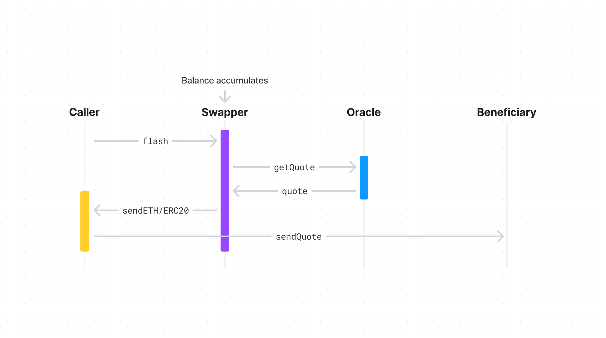

import { Toggle } from '../../../components/toggle'
import { Tab, Tabs } from 'nextra-theme-docs'

# Swapper

Swapper is a payable smart contract that converts all incoming tokens into a
single output token. Whenever ETH and ERC20s are received by a Swapper, they're
automatically swapped into the specified output token. The clearing price is
determined by a modular oracle, which is configured during Swapper creation.

- [Github](https://github.com/0xSplits/splits-swapper)
- [Contracts & Natspec](https://github.com/0xSplits/splits-swapper/tree/main/src)
- Related: [Oracle]()
- SDK coming soon

## How it works

- Each Swapper is a payable smart contract with a specified beneficiary, output
  token (ETH or any ERC20), and oracle. The oracle is modular so be very careful
  to use a secure oracle with sensible defaults & overrides for desired
  behavior. 0xSplits currently has one [oracle](), which uses UniswapV3 TWAP.
- Tokens received by Swapper are held in the contract's balance until `flash` is
  called. When `flash` is called, the caller sends the expected amount (as
  determined by the oracle) to the beneficiary in exchange for the balance in
  Swapper. This means _the caller is trading with Swapper directly_, earning the
  balance in exchange for sending the expected value to the beneficiary.
- Each Swapper can be owned, which means the **owner has full control of the
  deployment**. The owner may change the oracle, pause the contract, and execute
  arbitrary transactions as their will. We recommend removing the owner if this
  contract is being used in any trustless setting.

## Addresses

<Tabs items={['Mainnets', 'Testnets']}>

<Tab>

Coming soon

</Tab>

<Tab>

Coming soon

</Tab>

</Tabs>
