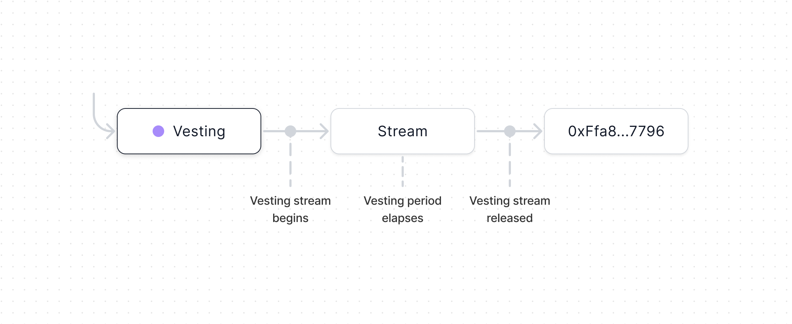

import { Toggle } from '../../../components/toggle'
import { Tab, Tabs } from 'nextra-theme-docs'

# Vesting

Vesting allows multiple, isolated streams of tokens to vest to an address over a
set period of time. All streams within the contract share a vesting period, but
each stream may begin vesting or release tokens independently.

- [Contracts](https://github.com/0xSplits/splits-vesting)
- [SDK](/dev/sdk/vesting)
- [Example](https://app.0xsplits.xyz/accounts/0xF29Ff96aaEa6C9A1fBa851f74737f3c069d4f1a9/)

## How It Works

- Each Vesting Module has a payable address to which ETH and ERC20 tokens can be
  sent.
- Tokens sent to the Vesting Module are held until a Vesting Stream is started.
  Vesting Streams are token-specific. Multiple Vesting Streams may exist
  simultaneously within the same Vesting Module.
- Once a Vesting Stream has begun, tokens in that stream will vest linearly and
  all tokens will be 100% vested by the end of the Vesting Period. At any time,
  anyone may release the vested portion from the Vesting Module to the
  Beneficiary.

## Addresses

<Tabs items={['Mainnets', 'Testnets']}>

<Tab>

### Mainnets

<Toggle title="Ethereum - 1">

| Contract       | Address                                                                                                                      |
| :------------- | :--------------------------------------------------------------------------------------------------------------------------- |
| Implementation | [`0x652a2a2876b855d9c30d9265f882f0a486608976`](https://etherscan.io/address/0x652a2a2876b855d9c30d9265f882f0a486608976#code) |
| Factory        | [`0x0a2841630f198745a55c4dab3fe98f77271949e5`](https://etherscan.io/address/0x0a2841630f198745a55c4dab3fe98f77271949e5#code) |

</Toggle>

<Toggle title="Optimism – 10">

| Contract       | Address                                                                                                                                 |
| :------------- | :-------------------------------------------------------------------------------------------------------------------------------------- |
| Implementation | [`0x652a2a2876b855d9c30d9265f882f0a486608976`](https://optimistic.etherscan.io/address/0x652a2a2876b855d9c30d9265f882f0a486608976#code) |
| Factory        | [`0x0a2841630f198745a55c4dab3fe98f77271949e5`](https://optimistic.etherscan.io/address/0x0a2841630f198745a55c4dab3fe98f77271949e5#code) |

</Toggle>

<Toggle title="BSC – 56">

| Contract       | Address                                                                                                                     |
| :------------- | :-------------------------------------------------------------------------------------------------------------------------- |
| Implementation | [`0x775B6e1CBcA6149875355e64450aAd9e645e6c2D`](https://bscscan.com/address/0x775B6e1CBcA6149875355e64450aAd9e645e6c2D#code) |
| Factory        | [`0x7205d93721837c45Be23C930D9fba842e968Ad69`](https://bscscan.com/address/0x7205d93721837c45Be23C930D9fba842e968Ad69#code) |

</Toggle>

<Toggle title="Gnosis – 100">

| Contract       | Address                                                                                                                       |
| :------------- | :---------------------------------------------------------------------------------------------------------------------------- |
| Implementation | [`0x652a2A2876B855d9c30d9265F882F0a486608976`](https://gnosisscan.io/address/0x652a2A2876B855d9c30d9265F882F0a486608976#code) |
| Factory        | [`0x0a2841630f198745a55C4dab3fE98f77271949E5`](https://gnosisscan.io/address/0x0a2841630f198745a55C4dab3fE98f77271949E5#code) |

</Toggle>

<Toggle title="Polygon – 137">

| Contract       | Address                                                                                                                         |
| :------------- | :------------------------------------------------------------------------------------------------------------------------------ |
| Implementation | [`0x652a2a2876b855d9c30d9265f882f0a486608976`](https://polygonscan.com/address/0x652a2a2876b855d9c30d9265f882f0a486608976#code) |
| Factory        | [`0x0a2841630f198745a55c4dab3fe98f77271949e5`](https://polygonscan.com/address/0x0a2841630f198745a55c4dab3fe98f77271949e5#code) |

</Toggle>

<Toggle title="Fantom – 250">

| Contract       | Address                                                                                                                     |
| :------------- | :-------------------------------------------------------------------------------------------------------------------------- |
| Implementation | [`0x652a2A2876B855d9c30d9265F882F0a486608976`](https://ftmscan.com/address/0x652a2A2876B855d9c30d9265F882F0a486608976#code) |
| Factory        | [`0x0a2841630f198745a55C4dab3fE98f77271949E5`](https://ftmscan.com/address/0x0a2841630f198745a55C4dab3fE98f77271949E5#code) |

</Toggle>

<Toggle title="Arbitrum – 42161">

| Contract       | Address                                                                                                                     |
| :------------- | :-------------------------------------------------------------------------------------------------------------------------- |
| Implementation | [`0x652a2a2876b855d9c30d9265f882f0a486608976`](https://arbiscan.io/address/0x652a2a2876b855d9c30d9265f882f0a486608976#code) |
| Factory        | [`0x0a2841630f198745a55c4dab3fe98f77271949e5`](https://arbiscan.io/address/0x0a2841630f198745a55c4dab3fe98f77271949e5#code) |

</Toggle>

<Toggle title="Avalanche – 43114">

| Contract       | Address                                                                                                                      |
| :------------- | :--------------------------------------------------------------------------------------------------------------------------- |
| Implementation | [`0x652a2A2876B855d9c30d9265F882F0a486608976`](https://snowtrace.io/address/0x652a2A2876B855d9c30d9265F882F0a486608976#code) |
| Factory        | [`0x0a2841630f198745a55C4dab3fE98f77271949E5`](https://snowtrace.io/address/0x0a2841630f198745a55C4dab3fE98f77271949E5#code) |

</Toggle>

<Toggle title="Aurora – 1313161554">

| Contract       | Address                                                                                                                        |
| :------------- | :----------------------------------------------------------------------------------------------------------------------------- |
| Implementation | [`0x652a2A2876B855d9c30d9265F882F0a486608976`](https://aurorascan.dev/address/0x652a2A2876B855d9c30d9265F882F0a486608976#code) |
| Factory        | [`0x0a2841630f198745a55C4dab3fE98f77271949E5`](https://aurorascan.dev/address/0x0a2841630f198745a55C4dab3fE98f77271949E5#code) |

</Toggle>

</Tab>

<Tab>

### Testnets

<Toggle title="Goerli - 5">

| Contract       | Address                                                                                                                             |
| :------------- | :---------------------------------------------------------------------------------------------------------------------------------- |
| Implementation | [`0x652a2a2876b855d9c30d9265f882f0a486608976`](https://goerli.etherscan.io/address/0x652a2a2876b855d9c30d9265f882f0a486608976#code) |
| Factory        | [`0x0a2841630f198745a55c4dab3fe98f77271949e5`](https://goerli.etherscan.io/address/0x0a2841630f198745a55c4dab3fe98f77271949e5#code) |

</Toggle>

<Toggle title="BSC Testnet – 97">

| Contract       | Address                                                                                                                             |
| :------------- | :---------------------------------------------------------------------------------------------------------------------------------- |
| Implementation | [`0x775B6e1CBcA6149875355e64450aAd9e645e6c2D`](https://testnet.bscscan.com/address/0x775B6e1CBcA6149875355e64450aAd9e645e6c2D#code) |
| Factory        | [`0x7205d93721837c45Be23C930D9fba842e968Ad69`](https://testnet.bscscan.com/address/0x7205d93721837c45Be23C930D9fba842e968Ad69#code) |

</Toggle>

<Toggle title="Optimism Goerli – 420">

| Contract       | Address                                                                                                                                      |
| :------------- | :------------------------------------------------------------------------------------------------------------------------------------------- |
| Implementation | [`0x652a2a2876b855d9c30d9265f882f0a486608976`](https://goerli-optimism.etherscan.io/address/0x652a2a2876b855d9c30d9265f882f0a486608976#code) |
| Factory        | [`0x0a2841630f198745a55c4dab3fe98f77271949e5`](https://goerli-optimism.etherscan.io/address/0x0a2841630f198745a55c4dab3fe98f77271949e5#code) |

</Toggle>

<Toggle title="Fantom Testnet – 4002">

| Contract       | Address                                                                                                                             |
| :------------- | :---------------------------------------------------------------------------------------------------------------------------------- |
| Implementation | [`0x652a2A2876B855d9c30d9265F882F0a486608976`](https://testnet.ftmscan.com/address/0x652a2A2876B855d9c30d9265F882F0a486608976#code) |
| Factory        | [`0x0a2841630f198745a55C4dab3fE98f77271949E5`](https://testnet.ftmscan.com/address/0x0a2841630f198745a55C4dab3fE98f77271949E5#code) |

</Toggle>

<Toggle title="Gnosis Chiado – 10200">

| Contract       | Address                                                                                                                                                        |
| :------------- | :------------------------------------------------------------------------------------------------------------------------------------------------------------- |
| Implementation | [`0x652a2A2876B855d9c30d9265F882F0a486608976`](https://blockscout.com/gnosis/chiado/address/0x652a2A2876B855d9c30d9265F882F0a486608976/contracts#address-tabs) |
| Factory        | [`0x0a2841630f198745a55C4dab3fE98f77271949E5`](https://blockscout.com/gnosis/chiado/address/0x0a2841630f198745a55C4dab3fE98f77271949E5/contracts#address-tabs) |

</Toggle>

<Toggle title="Avalanche Fuji – 43113">

| Contract       | Address                                                                                                                              |
| :------------- | :----------------------------------------------------------------------------------------------------------------------------------- |
| Implementation | [`0x652a2A2876B855d9c30d9265F882F0a486608976`](https://testnet.snowtrace.io/address/0x652a2A2876B855d9c30d9265F882F0a486608976#code) |
| Factory        | [`0x0a2841630f198745a55C4dab3fE98f77271949E5`](https://testnet.snowtrace.io/address/0x0a2841630f198745a55C4dab3fE98f77271949E5#code) |

</Toggle>

<Toggle title="Polygon Mumbai – 80001">

| Contract       | Address                                                                                                                                |
| :------------- | :------------------------------------------------------------------------------------------------------------------------------------- |
| Implementation | [`0x652a2a2876b855d9c30d9265f882f0a486608976`](https://mumbai.polygonscan.com/address/0x652a2a2876b855d9c30d9265f882f0a486608976#code) |
| Factory        | [`0x0a2841630f198745a55c4dab3fe98f77271949e5`](https://mumbai.polygonscan.com/address/0x0a2841630f198745a55c4dab3fe98f77271949e5#code) |

</Toggle>

<Toggle title="Arbitrum Goerli – 421613">

| Contract       | Address                                                                                                                                                              |
| :------------- | :------------------------------------------------------------------------------------------------------------------------------------------------------------------- |
| Implementation | [`0x652a2a2876b855d9c30d9265f882f0a486608976`](https://goerli-rollup-explorer.arbitrum.io/address/0x652a2a2876b855d9c30d9265f882f0a486608976/contracts#address-tabs) |
| Factory        | [`0x0a2841630f198745a55c4dab3fe98f77271949e5`](https://goerli-rollup-explorer.arbitrum.io/address/0x0a2841630f198745a55c4dab3fe98f77271949e5/contracts#address-tabs) |

</Toggle>

<Toggle title="Aurora Testnet – 1313161555">

| Contract       | Address                                                                                                                                |
| :------------- | :------------------------------------------------------------------------------------------------------------------------------------- |
| Implementation | [`0x652a2A2876B855d9c30d9265F882F0a486608976`](https://testnet.aurorascan.dev/address/0x652a2A2876B855d9c30d9265F882F0a486608976#code) |
| Factory        | [`0x0a2841630f198745a55C4dab3fE98f77271949E5`](https://testnet.aurorascan.dev/address/0x0a2841630f198745a55C4dab3fE98f77271949E5#code) |

</Toggle>

</Tab>

</Tabs>

## Notes

- This module is immutable. Once it's been created, it cannot be changed.
- This module is designed to be used in conjunction with a
  [Mutable Split](/core-concepts#mutable-split). Technically it works with an
  immutable Split, however, vesting tokens to an immutable Split is equivalent
  to sending all tokens at once.
- Vesting Modules must be unique. Multiple Vesting Modules can point to the same
  Beneficiary, however, no two Vesting Modules can have identical Beneficiaries
  and Vesting Periods. You can always create a new Vesting Stream within the
  existing Vesting Module – it's unnecessary to duplicate an existing Vesting
  Module.
