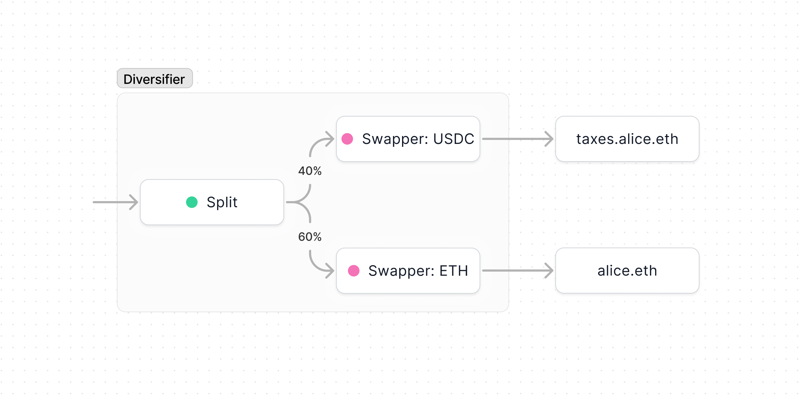
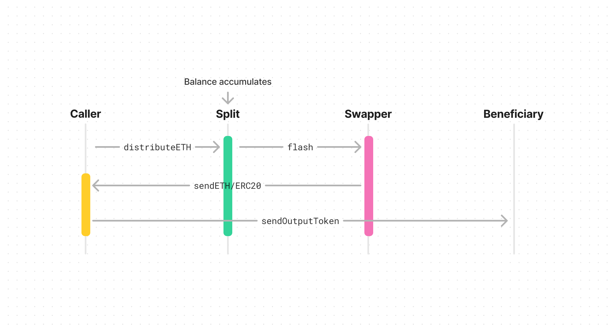

import { Toggle } from '../../../components/toggle'
import { Tab, Tabs } from 'nextra-theme-docs'

# Diversifier

Diversifier is a smart contract that automatically diversifies an income stream
into specified ratios of different tokens. This is particularly useful for tax
withholdings, for example when you want to automatically swap 40% of your income
into a stablecoin and set aside for taxes.

- [Github](https://github.com/0xSplits/splits-diversifier)
- [Contracts & Natspec](https://github.com/0xSplits/splits-diversifier/tree/main/src)
- Related: [Split](/contracts/core/split), [Swapper](/contracts/core/swapper)
- SDK coming soon

## How it works

- Each Diversifier is a payable smart contract that uses a
  [Split](/contracts/core/split) to automatically split incoming tokens
  according to pre-set percentages. Each recipient of the Split is a
  [Swapper](/contracts/core/swapper) that automatically swaps tokens into a
  specified output token. That's all there is to it, so if that sounds
  complicated we recommend you review the Split and Swapper contracts.
- Tokens received by Diversifier are held in the contract's balance until
  `distribute` is called. When `distribute` is called, the balance is split
  according to the set percentages. Tokens are then transferred to each Swapper,
  where they're converted into the desired output tokens and sent to the
  beneficiaries.
- Each Diversified can be owned, which means the owner has full control of the
  deployment. The owner may modify the Split, change the oracles, pause the
  Swappers, and execute arbitrary transactions at their will. We recommend
  removing the owner or making it a multisig if this contract is being used in
  any trustless setting.

## Addresses

<Tabs items={['Mainnets', 'Testnets']}>

<Tab>

Coming soon

</Tab>

<Tab>

Coming soon

</Tab>

</Tabs>
