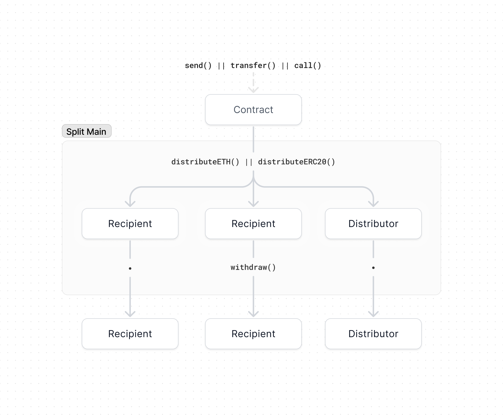

# Core contracts

This section describes the various smart contract building blocks upon which all
payment flows are built.

## Flow of funds

We recommend reading the [flow of funds](/flow) page if you haven't already. The
below diagram shows the different methods for moving funds through the system.
Though each contract's _distribution logic_ is unique, the general three steps
are the same.

1. **Receive**: ETH and ERC20 tokens flow into the contract via `send`,
   `transfer`, or `call` and the contract's balance increases
2. **Distribute**: Once a contract has a positive balance, anyone can call
   `distributeETH` or `distributeERC20` and earn the distributor fee
3. **Withdraw**: can call `withdraw` at anytime for any account, thereby
   withdrawing that account's balance in SplitMain
