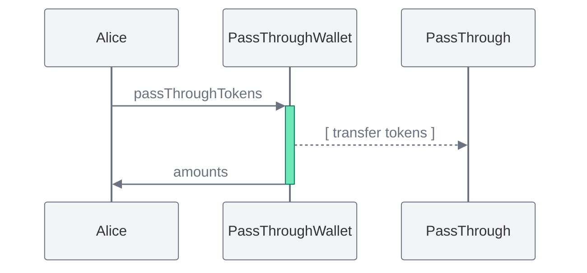

import { Toggle } from '../../components/toggle'
import { Tab, Tabs } from 'nextra-theme-docs'

# Pass-Through Wallet

Pass-Through Wallet is a payable, ownable smart contract wallet with pausable
token forwarding.

- [Github](https://github.com/0xSplits/splits-pass-through-wallet)
- [Contracts & Natspec](https://github.com/0xSplits/splits-pass-through-wallet/tree/main/src)
- Related: [Diversifier](/templates/diversifier)

## How it works

- Funds are held in the contract's balance until `passThroughTokens` is called.
  At any time the owner may pause `passThroughTokens`, update the pass-through
  address, or execute arbitrary calls from the Pass-Through Wallet.

## Addresses

<Tabs items={['Mainnets', 'Testnets']}>

<Tab>

<Toggle title="Ethereum – 1">

| Contract       | Address                                                                                                                      |
| :------------- | :--------------------------------------------------------------------------------------------------------------------------- |
| Implementation | [`0xfE87400C401C0CB61EC3a923a5d9873090e8daFc`](https://etherscan.io/address/0xfE87400C401C0CB61EC3a923a5d9873090e8daFc#code) |
| Factory        | [`0xF5aCC1568706Fbf9A55a77DdBe8DF907Da95dD6B`](https://etherscan.io/address/0xF5aCC1568706Fbf9A55a77DdBe8DF907Da95dD6B#code) |

</Toggle>

<Toggle title="Base – 8453">

| Contract       | Address                                                                                                                      |
| :------------- | :--------------------------------------------------------------------------------------------------------------------------- |
| Implementation | [`0xf62d6eBbc108b8B16218Dbf8FC0e249BA9fBb4bc`](https://basescan.org/address/0xf62d6eBbc108b8B16218Dbf8FC0e249BA9fBb4bc#code) |
| Factory        | [`0x52d6838957ec268cc5B50F17F9b490cbAb0A9E40`](https://basescan.org/address/0x52d6838957ec268cc5B50F17F9b490cbAb0A9E40#code) |

</Toggle>

<Toggle title="Optimism – 10">

| Contract       | Address                                                                                                                                 |
| :------------- | :-------------------------------------------------------------------------------------------------------------------------------------- |
| Implementation | [`0xf62d6eBbc108b8B16218Dbf8FC0e249BA9fBb4bc`](https://optimistic.etherscan.io/address/0xf62d6eBbc108b8B16218Dbf8FC0e249BA9fBb4bc#code) |
| Factory        | [`0x52d6838957ec268cc5B50F17F9b490cbAb0A9E40`](https://optimistic.etherscan.io/address/0x52d6838957ec268cc5B50F17F9b490cbAb0A9E40#code) |

</Toggle>

<Toggle title="Polygon – 137">

| Contract       | Address                                                                                                                         |
| :------------- | :------------------------------------------------------------------------------------------------------------------------------ |
| Implementation | [`0xf62d6eBbc108b8B16218Dbf8FC0e249BA9fBb4bc`](https://polygonscan.com/address/0xf62d6eBbc108b8B16218Dbf8FC0e249BA9fBb4bc#code) |
| Factory        | [`0x52d6838957ec268cc5B50F17F9b490cbAb0A9E40`](https://polygonscan.com/address/0x52d6838957ec268cc5B50F17F9b490cbAb0A9E40#code) |

</Toggle>

<Toggle title="Arbitrum – 42161">

| Contract       | Address                                                                                                                     |
| :------------- | :-------------------------------------------------------------------------------------------------------------------------- |
| Implementation | [`0xf62d6eBbc108b8B16218Dbf8FC0e249BA9fBb4bc`](https://arbiscan.io/address/0xf62d6eBbc108b8B16218Dbf8FC0e249BA9fBb4bc#code) |
| Factory        | [`0x52d6838957ec268cc5B50F17F9b490cbAb0A9E40`](https://arbiscan.io/address/0x52d6838957ec268cc5B50F17F9b490cbAb0A9E40#code) |

</Toggle>

</Tab>

<Tab>

<Toggle title="Goerli – 5">

| Contract       | Address                                                                                                                             |
| :------------- | :---------------------------------------------------------------------------------------------------------------------------------- |
| Implementation | [`0xfE87400C401C0CB61EC3a923a5d9873090e8daFc`](https://goerli.etherscan.io/address/0xfE87400C401C0CB61EC3a923a5d9873090e8daFc#code) |
| Factory        | [`0xF5aCC1568706Fbf9A55a77DdBe8DF907Da95dD6B`](https://goerli.etherscan.io/address/0xF5aCC1568706Fbf9A55a77DdBe8DF907Da95dD6B#code) |

</Toggle>

<Toggle title="Sepolia – 11155111">

| Contract       | Address                                                                                                                              |
| :------------- | :----------------------------------------------------------------------------------------------------------------------------------- |
| Implementation | [`0xf62d6eBbc108b8B16218Dbf8FC0e249BA9fBb4bc`](https://sepolia.etherscan.io/address/0xf62d6eBbc108b8B16218Dbf8FC0e249BA9fBb4bc#code) |
| Factory        | [`0x52d6838957ec268cc5B50F17F9b490cbAb0A9E40`](https://sepolia.etherscan.io/address/0x52d6838957ec268cc5B50F17F9b490cbAb0A9E40#code) |

</Toggle>

</Tab>

</Tabs>
