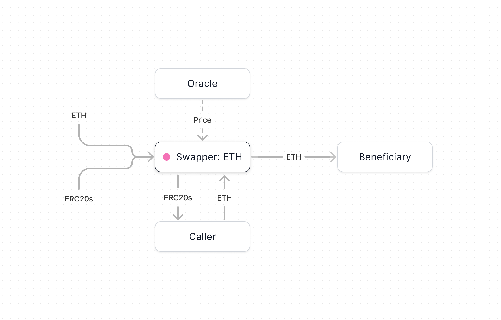

import { Toggle } from '../../components/toggle'
import { Callout, Tab, Tabs } from 'nextra-theme-docs'

# Swapper

Swapper is a payable smart contract that converts all incoming tokens into a
single output token. When ETH and ERC20s are received by a Swapper, they're
automatically swapped into the output token according to the oracle's clearing
price and the swapper's discount. If the oracle is unable to determine a
clearing price (i.e., it doesn't support tokens it has received), the Swapper's
owner **must** handle those tokens manually (e.g. swap or withdraw via execCalls;
the former is enabled for some token-pairs by our UI).

<Callout type="warning">
  Swappers without owners will **not** be able to recover tokens received that 
  aren't supported by their oracle. Be very careful when using immutable Swappers!
</Callout>

- Create at [swapper.new](https://app.splits.org/new/swapper/)
- [Github](https://github.com/0xSplits/splits-swapper)
- [Contracts & Natspec](https://github.com/0xSplits/splits-swapper/tree/main/src)
- Related: [Oracle](/core/oracle), [Diversifier](/templates/diversifier)

## How it works

- Each Swapper is a payable smart contract with a beneficiary, output token (ETH
  or any ERC20), oracle, discount, and owner. The oracle is modular so be
  careful to **use a secure oracle** with sensible settings for your desired
  behavior. You can use whatever oracle contract you'd like. Splits currently
  offers two [oracles](/core/oracle): Uniswap v3 TWAP and Chainlink.
- Tokens received by Swapper are held in the contract's balance until `flash` is
  called. When `flash` is called, the caller sends the expected amount (as
  determined by the oracle and discount) to the beneficiary in exchange for the
  balance in Swapper. This means _the caller is trading with Swapper directly_,
  earning the balance in exchange for sending the expected value to the
  beneficiary.
- Each Swapper can be owned, which means the **owner has full control of the
  deployment**. The owner may change the beneficiary or oracle, pause the
  contract, and execute arbitrary transactions at their will. We recommend
  removing the owner or making it a multisig if Swapper is being used in any
  trustless setting.

## Addresses

<Tabs items={['Mainnets', 'Testnets']}>

<Tab>

<Toggle title="Ethereum – 1">

| Contract       | Address                                                                                                                      |
| :------------- | :--------------------------------------------------------------------------------------------------------------------------- |
| Implementation | [`0x7fcdD45101E35fd626A539BA565d26A72d95fDa7`](https://etherscan.io/address/0x7fcdD45101E35fd626A539BA565d26A72d95fDa7#code) |
| Factory        | [`0xa244bbe019cf1BA177EE5A532250be2663Fb55cA`](https://etherscan.io/address/0xa244bbe019cf1BA177EE5A532250be2663Fb55cA#code) |

</Toggle>

<Toggle title="Base – 8453">

| Contract       | Address                                                                                                                      |
| :------------- | :--------------------------------------------------------------------------------------------------------------------------- |
| Implementation | [`0x7fcdD45101E35fd626A539BA565d26A72d95fDa7`](https://basescan.org/address/0x7fcdD45101E35fd626A539BA565d26A72d95fDa7#code) |
| Factory        | [`0xa244bbe019cf1BA177EE5A532250be2663Fb55cA`](https://basescan.org/address/0xa244bbe019cf1BA177EE5A532250be2663Fb55cA#code) |

</Toggle>

<Toggle title="Optimism – 10">

| Contract       | Address                                                                                                                                 |
| :------------- | :-------------------------------------------------------------------------------------------------------------------------------------- |
| Implementation | [`0x7fcdD45101E35fd626A539BA565d26A72d95fDa7`](https://optimistic.etherscan.io/address/0x7fcdD45101E35fd626A539BA565d26A72d95fDa7#code) |
| Factory        | [`0xa244bbe019cf1BA177EE5A532250be2663Fb55cA`](https://optimistic.etherscan.io/address/0xa244bbe019cf1BA177EE5A532250be2663Fb55cA#code) |

</Toggle>

<Toggle title="Polygon – 137">

| Contract       | Address                                                                                                                         |
| :------------- | :------------------------------------------------------------------------------------------------------------------------------ |
| Implementation | [`0x7fcdD45101E35fd626A539BA565d26A72d95fDa7`](https://polygonscan.com/address/0x7fcdD45101E35fd626A539BA565d26A72d95fDa7#code) |
| Factory        | [`0xa244bbe019cf1BA177EE5A532250be2663Fb55cA`](https://polygonscan.com/address/0xa244bbe019cf1BA177EE5A532250be2663Fb55cA#code) |

</Toggle>

<Toggle title="Arbitrum – 42161">

| Contract       | Address                                                                                                                     |
| :------------- | :-------------------------------------------------------------------------------------------------------------------------- |
| Implementation | [`0x7fcdD45101E35fd626A539BA565d26A72d95fDa7`](https://arbiscan.io/address/0x7fcdD45101E35fd626A539BA565d26A72d95fDa7#code) |
| Factory        | [`0xa244bbe019cf1BA177EE5A532250be2663Fb55cA`](https://arbiscan.io/address/0xa244bbe019cf1BA177EE5A532250be2663Fb55cA#code) |

</Toggle>

</Tab>

<Tab>

<Toggle title="Goerli – 5">

| Contract       | Address                                                                                                                             |
| :------------- | :---------------------------------------------------------------------------------------------------------------------------------- |
| Implementation | [`0x7fcdD45101E35fd626A539BA565d26A72d95fDa7`](https://goerli.etherscan.io/address/0x7fcdD45101E35fd626A539BA565d26A72d95fDa7#code) |
| Factory        | [`0xa244bbe019cf1BA177EE5A532250be2663Fb55cA`](https://goerli.etherscan.io/address/0xa244bbe019cf1BA177EE5A532250be2663Fb55cA#code) |

</Toggle>

<Toggle title="Sepolia – 11155111">

| Contract       | Address                                                                                                                              |
| :------------- | :----------------------------------------------------------------------------------------------------------------------------------- |
| Implementation | [`0x7fcdD45101E35fd626A539BA565d26A72d95fDa7`](https://sepolia.etherscan.io/address/0x7fcdD45101E35fd626A539BA565d26A72d95fDa7#code) |
| Factory        | [`0xa244bbe019cf1BA177EE5A532250be2663Fb55cA`](https://sepolia.etherscan.io/address/0xa244bbe019cf1BA177EE5A532250be2663Fb55cA#code) |

</Toggle>

</Tab>

</Tabs>
