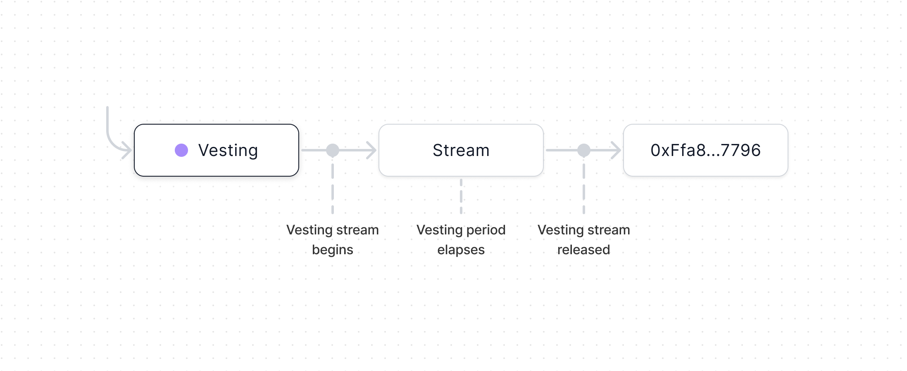

import { Toggle } from '../../components/toggle'
import { Tab, Tabs } from 'nextra-theme-docs'

# Vesting

Vesting allows multiple, isolated streams of tokens to vest to an address over a
set period of time. All streams within the contract share a vesting period, but
each stream may begin vesting or release tokens independently.

- [Contracts & NatSpec](https://github.com/0xSplits/splits-vesting/tree/master/src)
- [Github](https://github.com/0xSplits/splits-vesting)
- [SDK](/sdk/vesting)
- [Example](https://app.splits.org/accounts/0xF29Ff96aaEa6C9A1fBa851f74737f3c069d4f1a9/)

## How It Works

- Each Vesting is a payable smart contract with a vesting period and a
  recipient. ETH and ERC20s sent to Vesting are held until a token-specific
  vesting stream is started. Multiple vesting streams may exist simultaneously
  within Vesting.
- Once a vesting stream has begun, tokens in that stream will vest linearly and
  all tokens will be 100% vested by the end of the vesting period. At any time,
  anyone may release the vested portion to the recipient.
- Since Vesting is immutable, it's designed to be used in conjunction with a
  mutable Split or any contract that can be modified. Vesting funds to an
  immutable contract is equivalent to sending all tokens at once, since there is
  no way to revoke a stream or remove funds within a Vesting before a stream has
  begun.
- It is unnecessary to duplicate a Vesting that already exists, therefore each
  Vesting must have a unique combination of vesting period and recipient.

## Addresses

<Tabs items={['Mainnets', 'Testnets']}>

<Tab>

<Toggle title="Ethereum - 1">

| Contract       | Address                                                                                                                      |
| :------------- | :--------------------------------------------------------------------------------------------------------------------------- |
| Implementation | [`0x652a2a2876b855d9c30d9265f882f0a486608976`](https://etherscan.io/address/0x652a2a2876b855d9c30d9265f882f0a486608976#code) |
| Factory        | [`0x0a2841630f198745a55c4dab3fe98f77271949e5`](https://etherscan.io/address/0x0a2841630f198745a55c4dab3fe98f77271949e5#code) |

</Toggle>

<Toggle title="Optimism – 10">

| Contract       | Address                                                                                                                                 |
| :------------- | :-------------------------------------------------------------------------------------------------------------------------------------- |
| Implementation | [`0x652a2a2876b855d9c30d9265f882f0a486608976`](https://optimistic.etherscan.io/address/0x652a2a2876b855d9c30d9265f882f0a486608976#code) |
| Factory        | [`0x0a2841630f198745a55c4dab3fe98f77271949e5`](https://optimistic.etherscan.io/address/0x0a2841630f198745a55c4dab3fe98f77271949e5#code) |

</Toggle>

<Toggle title="BSC – 56">

| Contract       | Address                                                                                                                     |
| :------------- | :-------------------------------------------------------------------------------------------------------------------------- |
| Implementation | [`0x775B6e1CBcA6149875355e64450aAd9e645e6c2D`](https://bscscan.com/address/0x775B6e1CBcA6149875355e64450aAd9e645e6c2D#code) |
| Factory        | [`0x7205d93721837c45Be23C930D9fba842e968Ad69`](https://bscscan.com/address/0x7205d93721837c45Be23C930D9fba842e968Ad69#code) |

</Toggle>

<Toggle title="Gnosis – 100">

| Contract       | Address                                                                                                                       |
| :------------- | :---------------------------------------------------------------------------------------------------------------------------- |
| Implementation | [`0x652a2A2876B855d9c30d9265F882F0a486608976`](https://gnosisscan.io/address/0x652a2A2876B855d9c30d9265F882F0a486608976#code) |
| Factory        | [`0x0a2841630f198745a55C4dab3fE98f77271949E5`](https://gnosisscan.io/address/0x0a2841630f198745a55C4dab3fE98f77271949E5#code) |

</Toggle>

<Toggle title="Polygon – 137">

| Contract       | Address                                                                                                                         |
| :------------- | :------------------------------------------------------------------------------------------------------------------------------ |
| Implementation | [`0x652a2a2876b855d9c30d9265f882f0a486608976`](https://polygonscan.com/address/0x652a2a2876b855d9c30d9265f882f0a486608976#code) |
| Factory        | [`0x0a2841630f198745a55c4dab3fe98f77271949e5`](https://polygonscan.com/address/0x0a2841630f198745a55c4dab3fe98f77271949e5#code) |

</Toggle>

<Toggle title="Fantom – 250">

| Contract       | Address                                                                                                                     |
| :------------- | :-------------------------------------------------------------------------------------------------------------------------- |
| Implementation | [`0x652a2A2876B855d9c30d9265F882F0a486608976`](https://ftmscan.com/address/0x652a2A2876B855d9c30d9265F882F0a486608976#code) |
| Factory        | [`0x0a2841630f198745a55C4dab3fE98f77271949E5`](https://ftmscan.com/address/0x0a2841630f198745a55C4dab3fE98f77271949E5#code) |

</Toggle>

<Toggle title="Base – 8453">

| Contract       | Address                                                                                                                      |
| :------------- | :--------------------------------------------------------------------------------------------------------------------------- |
| Implementation | [`0x652a2a2876b855d9c30d9265f882f0a486608976`](https://basescan.org/address/0x652a2a2876b855d9c30d9265f882f0a486608976#code) |
| Factory        | [`0x0a2841630f198745a55c4dab3fe98f77271949e5`](https://basescan.org/address/0x0a2841630f198745a55c4dab3fe98f77271949e5#code) |

</Toggle>

<Toggle title="Arbitrum – 42161">

| Contract       | Address                                                                                                                     |
| :------------- | :-------------------------------------------------------------------------------------------------------------------------- |
| Implementation | [`0x652a2a2876b855d9c30d9265f882f0a486608976`](https://arbiscan.io/address/0x652a2a2876b855d9c30d9265f882f0a486608976#code) |
| Factory        | [`0x0a2841630f198745a55c4dab3fe98f77271949e5`](https://arbiscan.io/address/0x0a2841630f198745a55c4dab3fe98f77271949e5#code) |

</Toggle>

<Toggle title="Avalanche – 43114">

| Contract       | Address                                                                                                                      |
| :------------- | :--------------------------------------------------------------------------------------------------------------------------- |
| Implementation | [`0x652a2A2876B855d9c30d9265F882F0a486608976`](https://snowtrace.io/address/0x652a2A2876B855d9c30d9265F882F0a486608976#code) |
| Factory        | [`0x0a2841630f198745a55C4dab3fE98f77271949E5`](https://snowtrace.io/address/0x0a2841630f198745a55C4dab3fE98f77271949E5#code) |

</Toggle>

<Toggle title="Zora – 7777777">

| Contract       | Address                                                                                                                                      |
| :------------- | :------------------------------------------------------------------------------------------------------------------------------------------- |
| Implementation | [`0x652a2a2876b855d9c30d9265f882f0a486608976`](https://explorer.zora.energy/address/0x652a2a2876b855d9c30d9265f882f0a486608976?tab=contract) |
| Factory        | [`0x0a2841630f198745a55c4dab3fe98f77271949e5`](https://explorer.zora.energy/address/0x0a2841630f198745a55c4dab3fe98f77271949e5?tab=contract) |

</Toggle>

<Toggle title="Aurora – 1313161554">

| Contract       | Address                                                                                                                        |
| :------------- | :----------------------------------------------------------------------------------------------------------------------------- |
| Implementation | [`0x652a2A2876B855d9c30d9265F882F0a486608976`](https://aurorascan.dev/address/0x652a2A2876B855d9c30d9265F882F0a486608976#code) |
| Factory        | [`0x0a2841630f198745a55C4dab3fE98f77271949E5`](https://aurorascan.dev/address/0x0a2841630f198745a55C4dab3fE98f77271949E5#code) |

</Toggle>

<Toggle title="Aurora – 42220">

| Contract       | Address                                                                                                                        |
| :------------- | :----------------------------------------------------------------------------------------------------------------------------- |
| Implementation | [`0x652a2A2876B855d9c30d9265F882F0a486608976`](https://celoscan.io/address/0x652a2A2876B855d9c30d9265F882F0a486608976#code) |
| Factory        | [`0x0a2841630f198745a55C4dab3fE98f77271949E5`](https://celoscan.io/address/0x0a2841630f198745a55C4dab3fE98f77271949E5#code) |

</Toggle>

</Tab>

<Tab>

<Toggle title="Goerli - 5">

| Contract       | Address                                                                                                                             |
| :------------- | :---------------------------------------------------------------------------------------------------------------------------------- |
| Implementation | [`0x652a2a2876b855d9c30d9265f882f0a486608976`](https://goerli.etherscan.io/address/0x652a2a2876b855d9c30d9265f882f0a486608976#code) |
| Factory        | [`0x0a2841630f198745a55c4dab3fe98f77271949e5`](https://goerli.etherscan.io/address/0x0a2841630f198745a55c4dab3fe98f77271949e5#code) |

</Toggle>

<Toggle title="Holesky - 17000">

| Contract       | Address                                                                                                                              |
| :------------- | :----------------------------------------------------------------------------------------------------------------------------------- |
| Implementation | [`0x652a2a2876b855d9c30d9265f882f0a486608976`](https://holesky.etherscan.io/address/0x652a2a2876b855d9c30d9265f882f0a486608976#code) |
| Factory        | [`0x0a2841630f198745a55c4dab3fe98f77271949e5`](https://holesky.etherscan.io/address/0x0a2841630f198745a55c4dab3fe98f77271949e5#code) |

</Toggle>

<Toggle title="Sepolia - 11155111">

| Contract       | Address                                                                                                                              |
| :------------- | :----------------------------------------------------------------------------------------------------------------------------------- |
| Implementation | [`0x652a2a2876b855d9c30d9265f882f0a486608976`](https://sepolia.etherscan.io/address/0x652a2a2876b855d9c30d9265f882f0a486608976#code) |
| Factory        | [`0x0a2841630f198745a55c4dab3fe98f77271949e5`](https://sepolia.etherscan.io/address/0x0a2841630f198745a55c4dab3fe98f77271949e5#code) |

</Toggle>

<Toggle title="BSC Testnet – 97">

| Contract       | Address                                                                                                                             |
| :------------- | :---------------------------------------------------------------------------------------------------------------------------------- |
| Implementation | [`0x775B6e1CBcA6149875355e64450aAd9e645e6c2D`](https://testnet.bscscan.com/address/0x775B6e1CBcA6149875355e64450aAd9e645e6c2D#code) |
| Factory        | [`0x7205d93721837c45Be23C930D9fba842e968Ad69`](https://testnet.bscscan.com/address/0x7205d93721837c45Be23C930D9fba842e968Ad69#code) |

</Toggle>

<Toggle title="Optimism Goerli – 420">

| Contract       | Address                                                                                                                                      |
| :------------- | :------------------------------------------------------------------------------------------------------------------------------------------- |
| Implementation | [`0x652a2a2876b855d9c30d9265f882f0a486608976`](https://goerli-optimism.etherscan.io/address/0x652a2a2876b855d9c30d9265f882f0a486608976#code) |
| Factory        | [`0x0a2841630f198745a55c4dab3fe98f77271949e5`](https://goerli-optimism.etherscan.io/address/0x0a2841630f198745a55c4dab3fe98f77271949e5#code) |

</Toggle>

<Toggle title="Fantom Testnet – 4002">

| Contract       | Address                                                                                                                             |
| :------------- | :---------------------------------------------------------------------------------------------------------------------------------- |
| Implementation | [`0x652a2A2876B855d9c30d9265F882F0a486608976`](https://testnet.ftmscan.com/address/0x652a2A2876B855d9c30d9265F882F0a486608976#code) |
| Factory        | [`0x0a2841630f198745a55C4dab3fE98f77271949E5`](https://testnet.ftmscan.com/address/0x0a2841630f198745a55C4dab3fE98f77271949E5#code) |

</Toggle>

<Toggle title="Gnosis Chiado – 10200">

| Contract       | Address                                                                                                                                                        |
| :------------- | :------------------------------------------------------------------------------------------------------------------------------------------------------------- |
| Implementation | [`0x652a2A2876B855d9c30d9265F882F0a486608976`](https://blockscout.com/gnosis/chiado/address/0x652a2A2876B855d9c30d9265F882F0a486608976/contracts#address-tabs) |
| Factory        | [`0x0a2841630f198745a55C4dab3fE98f77271949E5`](https://blockscout.com/gnosis/chiado/address/0x0a2841630f198745a55C4dab3fE98f77271949E5/contracts#address-tabs) |

</Toggle>

<Toggle title="Avalanche Fuji – 43113">

| Contract       | Address                                                                                                                              |
| :------------- | :----------------------------------------------------------------------------------------------------------------------------------- |
| Implementation | [`0x652a2A2876B855d9c30d9265F882F0a486608976`](https://testnet.snowtrace.io/address/0x652a2A2876B855d9c30d9265F882F0a486608976#code) |
| Factory        | [`0x0a2841630f198745a55C4dab3fE98f77271949E5`](https://testnet.snowtrace.io/address/0x0a2841630f198745a55C4dab3fE98f77271949E5#code) |

</Toggle>

<Toggle title="Polygon Mumbai – 80001">

| Contract       | Address                                                                                                                                |
| :------------- | :------------------------------------------------------------------------------------------------------------------------------------- |
| Implementation | [`0x652a2a2876b855d9c30d9265f882f0a486608976`](https://mumbai.polygonscan.com/address/0x652a2a2876b855d9c30d9265f882f0a486608976#code) |
| Factory        | [`0x0a2841630f198745a55c4dab3fe98f77271949e5`](https://mumbai.polygonscan.com/address/0x0a2841630f198745a55c4dab3fe98f77271949e5#code) |

</Toggle>

<Toggle title="Arbitrum Goerli – 421613">

| Contract       | Address                                                                                                                                                              |
| :------------- | :------------------------------------------------------------------------------------------------------------------------------------------------------------------- |
| Implementation | [`0x652a2a2876b855d9c30d9265f882f0a486608976`](https://goerli-rollup-explorer.arbitrum.io/address/0x652a2a2876b855d9c30d9265f882f0a486608976/contracts#address-tabs) |
| Factory        | [`0x0a2841630f198745a55c4dab3fe98f77271949e5`](https://goerli-rollup-explorer.arbitrum.io/address/0x0a2841630f198745a55c4dab3fe98f77271949e5/contracts#address-tabs) |

</Toggle>

<Toggle title="Aurora Testnet – 1313161555">

| Contract       | Address                                                                                                                                |
| :------------- | :------------------------------------------------------------------------------------------------------------------------------------- |
| Implementation | [`0x652a2A2876B855d9c30d9265F882F0a486608976`](https://testnet.aurorascan.dev/address/0x652a2A2876B855d9c30d9265F882F0a486608976#code) |
| Factory        | [`0x0a2841630f198745a55C4dab3fE98f77271949E5`](https://testnet.aurorascan.dev/address/0x0a2841630f198745a55C4dab3fE98f77271949E5#code) |

</Toggle>

</Tab>

</Tabs>
