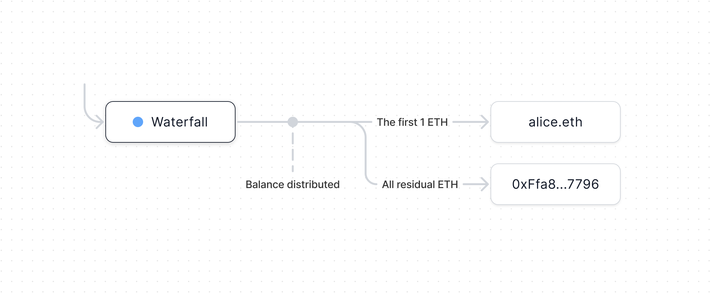

import { Toggle } from '../../components/toggle'
import { Tab, Tabs } from 'nextra-theme-docs'

# Waterfall

Waterfall acts as a debt instrument by letting you specify the order in which
distributions occur. It's useful when you want to pay one recipient a specific
amount _before_ paying another recipient. Just like a Split, a Waterfall is a
payable smart contract that is composable on both inflow and outflow.

- Create at [waterfall.new](https://app.splits.org/new/waterfall/)
- [Contracts & Natspec](https://github.com/0xSplits/splits-waterfall/tree/master/src)
- [Github](https://github.com/0xSplits/splits-waterfall)
- [SDK](/sdk/waterfall)
- [Example](https://app.splits.org/accounts/0x3511373c3C78cD04C86c87628238435D7F3E6C4f/)

## How It Works

- Each Waterfall is a payable smart contract with two or more tranches. Each
  tranche has a recipient (any payable address) and a threshold (the max number
  of tokens it will receive). The final tranche has no threshold and will always
  receive all residual tokens.
- ETH and ERC20s sent to a Waterfall are stored in the contract as a balance.
  When the balance is distributed, each tranche sends funds to the recipient
  only after the preceding trance has been filled. This repeats until the all
  tranches have been filled, at which point all residual funds are sent to the
  final tranche recipient.
- The Waterfall is an immutable contract—once it's been created, it cannot be
  changed. Funds flow unidirectionally and tranches do not reset, meaning the
  only way to "restart" the sequence is to create a new Waterfall.
- Any non-permitted tokens sent to the Waterfall may be recovered to any of the
  tranche recipients.
- This contract was not designed for a large number of tranches and shouldn't be
  used with more than 1,000.

## Addresses

<Tabs items={['Mainnets', 'Testnets']}>

<Tab>

<Toggle title="Ethereum - 1">

| Contract       | Address                                                                                                                      |
| :------------- | :--------------------------------------------------------------------------------------------------------------------------- |
| Implementation | [`0x1A1314121B06f1E358Eec90E76E459a679c88863`](https://etherscan.io/address/0x1A1314121B06f1E358Eec90E76E459a679c88863#code) |
| Factory        | [`0x4Df01754eBd055498C8087b1e9a5c7a9ad19b0F6`](https://etherscan.io/address/0x4Df01754eBd055498C8087b1e9a5c7a9ad19b0F6#code) |

</Toggle>

<Toggle title="Optimism – 10">

| Contract       | Address                                                                                                                                 |
| :------------- | :-------------------------------------------------------------------------------------------------------------------------------------- |
| Implementation | [`0x1A1314121B06f1E358Eec90E76E459a679c88863`](https://optimistic.etherscan.io/address/0x1A1314121B06f1E358Eec90E76E459a679c88863#code) |
| Factory        | [`0x4Df01754eBd055498C8087b1e9a5c7a9ad19b0F6`](https://optimistic.etherscan.io/address/0x4Df01754eBd055498C8087b1e9a5c7a9ad19b0F6#code) |

</Toggle>

<Toggle title="BSC – 56">

| Contract       | Address                                                                                                                     |
| :------------- | :-------------------------------------------------------------------------------------------------------------------------- |
| Implementation | [`0xB2641a863d9832e11181103038566752b852E7c4`](https://bscscan.com/address/0xB2641a863d9832e11181103038566752b852E7c4#code) |
| Factory        | [`0xB7CCCcCeb459F0910589556123dC5fA6DC8dE4E0`](https://bscscan.com/address/0xB7CCCcCeb459F0910589556123dC5fA6DC8dE4E0#code) |

</Toggle>

<Toggle title="Gnosis – 100">

| Contract       | Address                                                                                                                       |
| :------------- | :---------------------------------------------------------------------------------------------------------------------------- |
| Implementation | [`0x1A1314121B06f1E358Eec90E76E459a679c88863`](https://gnosisscan.io/address/0x1A1314121B06f1E358Eec90E76E459a679c88863#code) |
| Factory        | [`0x4Df01754eBd055498C8087b1e9a5c7a9ad19b0F6`](https://gnosisscan.io/address/0x4Df01754eBd055498C8087b1e9a5c7a9ad19b0F6#code) |

</Toggle>

<Toggle title="Polygon – 137">

| Contract       | Address                                                                                                                         |
| :------------- | :------------------------------------------------------------------------------------------------------------------------------ |
| Implementation | [`0x1A1314121B06f1E358Eec90E76E459a679c88863`](https://polygonscan.com/address/0x1A1314121B06f1E358Eec90E76E459a679c88863#code) |
| Factory        | [`0x4Df01754eBd055498C8087b1e9a5c7a9ad19b0F6`](https://polygonscan.com/address/0x4Df01754eBd055498C8087b1e9a5c7a9ad19b0F6#code) |

</Toggle>

<Toggle title="Fantom – 250">

| Contract       | Address                                                                                                                     |
| :------------- | :-------------------------------------------------------------------------------------------------------------------------- |
| Implementation | [`0x1A1314121B06f1E358Eec90E76E459a679c88863`](https://ftmscan.com/address/0x1A1314121B06f1E358Eec90E76E459a679c88863#code) |
| Factory        | [`0x4Df01754eBd055498C8087b1e9a5c7a9ad19b0F6`](https://ftmscan.com/address/0x4Df01754eBd055498C8087b1e9a5c7a9ad19b0F6#code) |

</Toggle>

<Toggle title="Base – 8453">

| Contract       | Address                                                                                                                      |
| :------------- | :--------------------------------------------------------------------------------------------------------------------------- |
| Implementation | [`0x1A1314121B06f1E358Eec90E76E459a679c88863`](https://basescan.org/address/0x1A1314121B06f1E358Eec90E76E459a679c88863#code) |
| Factory        | [`0x4Df01754eBd055498C8087b1e9a5c7a9ad19b0F6`](https://basescan.org/address/0x4Df01754eBd055498C8087b1e9a5c7a9ad19b0F6#code) |

</Toggle>

<Toggle title="Arbitrum – 42161">

| Contract       | Address                                                                                                                     |
| :------------- | :-------------------------------------------------------------------------------------------------------------------------- |
| Implementation | [`0x1A1314121B06f1E358Eec90E76E459a679c88863`](https://arbiscan.io/address/0x1A1314121B06f1E358Eec90E76E459a679c88863#code) |
| Factory        | [`0x4Df01754eBd055498C8087b1e9a5c7a9ad19b0F6`](https://arbiscan.io/address/0x4Df01754eBd055498C8087b1e9a5c7a9ad19b0F6#code) |

</Toggle>

<Toggle title="Avalanche – 43114">

| Contract       | Address                                                                                                                      |
| :------------- | :--------------------------------------------------------------------------------------------------------------------------- |
| Implementation | [`0x1A1314121B06f1E358Eec90E76E459a679c88863`](https://snowtrace.io/address/0x1A1314121B06f1E358Eec90E76E459a679c88863#code) |
| Factory        | [`0x4Df01754eBd055498C8087b1e9a5c7a9ad19b0F6`](https://snowtrace.io/address/0x4Df01754eBd055498C8087b1e9a5c7a9ad19b0F6#code) |

</Toggle>

<Toggle title="Zora – 7777777">

| Contract       | Address                                                                                                                                      |
| :------------- | :------------------------------------------------------------------------------------------------------------------------------------------- |
| Implementation | [`0x1A1314121B06f1E358Eec90E76E459a679c88863`](https://explorer.zora.energy/address/0x1A1314121B06f1E358Eec90E76E459a679c88863?tab=contract) |
| Factory        | [`0x4Df01754eBd055498C8087b1e9a5c7a9ad19b0F6`](https://explorer.zora.energy/address/0x4Df01754eBd055498C8087b1e9a5c7a9ad19b0F6?tab=contract) |

</Toggle>

<Toggle title="Aurora – 1313161554">

| Contract       | Address                                                                                                                        |
| :------------- | :----------------------------------------------------------------------------------------------------------------------------- |
| Implementation | [`0x1A1314121B06f1E358Eec90E76E459a679c88863`](https://aurorascan.dev/address/0x1A1314121B06f1E358Eec90E76E459a679c88863#code) |
| Factory        | [`0x4Df01754eBd055498C8087b1e9a5c7a9ad19b0F6`](https://aurorascan.dev/address/0x4Df01754eBd055498C8087b1e9a5c7a9ad19b0F6#code) |

</Toggle>

</Tab>

<Tab>

<Toggle title="Goerli - 5">

| Contract       | Address                                                                                                                             |
| :------------- | :---------------------------------------------------------------------------------------------------------------------------------- |
| Implementation | [`0x1A1314121B06f1E358Eec90E76E459a679c88863`](https://goerli.etherscan.io/address/0x1A1314121B06f1E358Eec90E76E459a679c88863#code) |
| Factory        | [`0x4Df01754eBd055498C8087b1e9a5c7a9ad19b0F6`](https://goerli.etherscan.io/address/0x4Df01754eBd055498C8087b1e9a5c7a9ad19b0F6#code) |

</Toggle>

<Toggle title="Holesky - 17000">

| Contract       | Address                                                                                                                              |
| :------------- | :----------------------------------------------------------------------------------------------------------------------------------- |
| Implementation | [`0x1A1314121B06f1E358Eec90E76E459a679c88863`](https://holesky.etherscan.io/address/0x1A1314121B06f1E358Eec90E76E459a679c88863#code) |
| Factory        | [`0x4Df01754eBd055498C8087b1e9a5c7a9ad19b0F6`](https://holesky.etherscan.io/address/0x4Df01754eBd055498C8087b1e9a5c7a9ad19b0F6#code) |

</Toggle>

<Toggle title="BSC Testnet – 97">

| Contract       | Address                                                                                                                             |
| :------------- | :---------------------------------------------------------------------------------------------------------------------------------- |
| Implementation | [`0xB2641a863d9832e11181103038566752b852E7c4`](https://testnet.bscscan.com/address/0xB2641a863d9832e11181103038566752b852E7c4#code) |
| Factory        | [`0xB7CCCcCeb459F0910589556123dC5fA6DC8dE4E0`](https://testnet.bscscan.com/address/0xB7CCCcCeb459F0910589556123dC5fA6DC8dE4E0#code) |

</Toggle>

<Toggle title="Optimism Goerli – 420">

| Contract       | Address                                                                                                                                      |
| :------------- | :------------------------------------------------------------------------------------------------------------------------------------------- |
| Implementation | [`0x1A1314121B06f1E358Eec90E76E459a679c88863`](https://goerli-optimism.etherscan.io/address/0x1A1314121B06f1E358Eec90E76E459a679c88863#code) |
| Factory        | [`0x4Df01754eBd055498C8087b1e9a5c7a9ad19b0F6`](https://goerli-optimism.etherscan.io/address/0x4Df01754eBd055498C8087b1e9a5c7a9ad19b0F6#code) |

</Toggle>

<Toggle title="Fantom Testnet – 4002">

| Contract       | Address                                                                                                                             |
| :------------- | :---------------------------------------------------------------------------------------------------------------------------------- |
| Implementation | [`0x1A1314121B06f1E358Eec90E76E459a679c88863`](https://testnet.ftmscan.com/address/0x1A1314121B06f1E358Eec90E76E459a679c88863#code) |
| Factory        | [`0x4Df01754eBd055498C8087b1e9a5c7a9ad19b0F6`](https://testnet.ftmscan.com/address/0x4Df01754eBd055498C8087b1e9a5c7a9ad19b0F6#code) |

</Toggle>

<Toggle title="Gnosis Chiado – 10200">

| Contract       | Address                                                                                                                                                        |
| :------------- | :------------------------------------------------------------------------------------------------------------------------------------------------------------- |
| Implementation | [`0x1A1314121B06f1E358Eec90E76E459a679c88863`](https://blockscout.com/gnosis/chiado/address/0x1A1314121B06f1E358Eec90E76E459a679c88863/contracts#address-tabs) |
| Factory        | [`0x4Df01754eBd055498C8087b1e9a5c7a9ad19b0F6`](https://blockscout.com/gnosis/chiado/address/0x4Df01754eBd055498C8087b1e9a5c7a9ad19b0F6/contracts#address-tabs) |

</Toggle>

<Toggle title="Avalanche Fuji – 43113">

| Contract       | Address                                                                                                                              |
| :------------- | :----------------------------------------------------------------------------------------------------------------------------------- |
| Implementation | [`0x1A1314121B06f1E358Eec90E76E459a679c88863`](https://testnet.snowtrace.io/address/0x1A1314121B06f1E358Eec90E76E459a679c88863#code) |
| Factory        | [`0x4Df01754eBd055498C8087b1e9a5c7a9ad19b0F6`](https://testnet.snowtrace.io/address/0x4Df01754eBd055498C8087b1e9a5c7a9ad19b0F6#code) |

</Toggle>

<Toggle title="Polygon Mumbai – 80001">

| Contract       | Address                                                                                                                                |
| :------------- | :------------------------------------------------------------------------------------------------------------------------------------- |
| Implementation | [`0x1A1314121B06f1E358Eec90E76E459a679c88863`](https://mumbai.polygonscan.com/address/0x1A1314121B06f1E358Eec90E76E459a679c88863#code) |
| Factory        | [`0x4Df01754eBd055498C8087b1e9a5c7a9ad19b0F6`](https://mumbai.polygonscan.com/address/0x4Df01754eBd055498C8087b1e9a5c7a9ad19b0F6#code) |

</Toggle>

<Toggle title="Arbitrum Goerli – 421613">

| Contract       | Address                                                                                                                                                              |
| :------------- | :------------------------------------------------------------------------------------------------------------------------------------------------------------------- |
| Implementation | [`0x1A1314121B06f1E358Eec90E76E459a679c88863`](https://goerli-rollup-explorer.arbitrum.io/address/0x1A1314121B06f1E358Eec90E76E459a679c88863/contracts#address-tabs) |
| Factory        | [`0x4Df01754eBd055498C8087b1e9a5c7a9ad19b0F6`](https://goerli-rollup-explorer.arbitrum.io/address/0x4Df01754eBd055498C8087b1e9a5c7a9ad19b0F6/contracts#address-tabs) |

</Toggle>

<Toggle title="Aurora Testnet – 1313161555">

| Contract       | Address                                                                                                                                |
| :------------- | :------------------------------------------------------------------------------------------------------------------------------------- |
| Implementation | [`0x1A1314121B06f1E358Eec90E76E459a679c88863`](https://testnet.aurorascan.dev/address/0x1A1314121B06f1E358Eec90E76E459a679c88863#code) |
| Factory        | [`0x4Df01754eBd055498C8087b1e9a5c7a9ad19b0F6`](https://testnet.aurorascan.dev/address/0x4Df01754eBd055498C8087b1e9a5c7a9ad19b0F6#code) |

</Toggle>

</Tab>

</Tabs>
