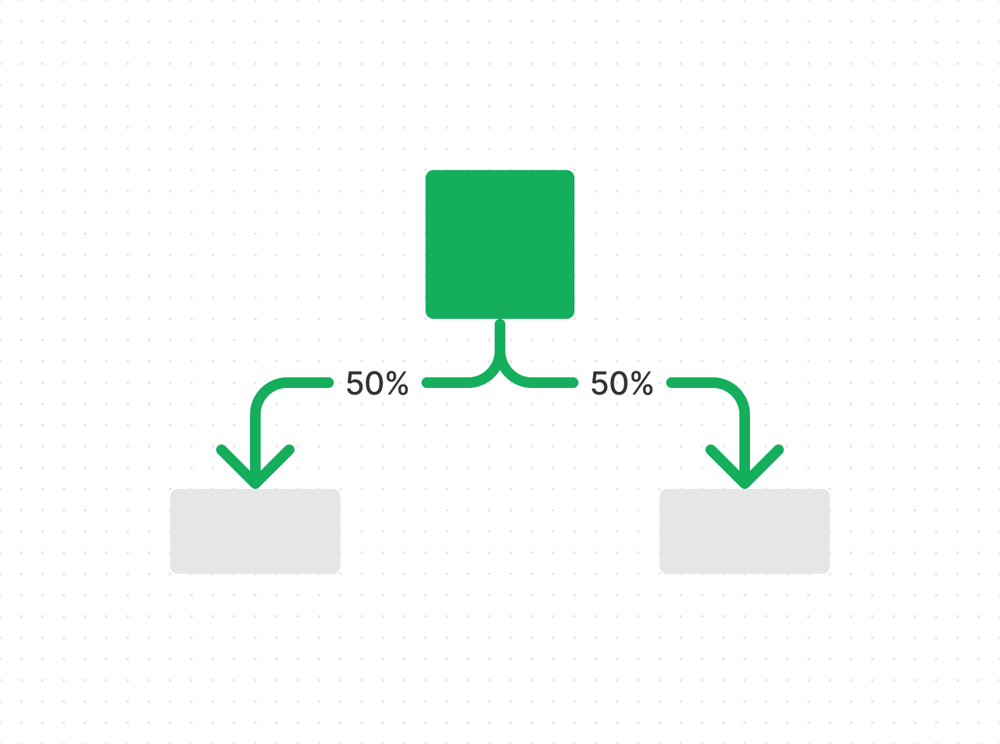
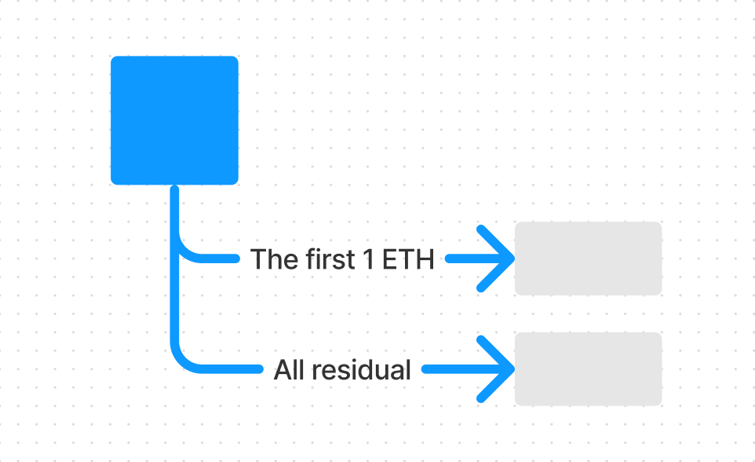
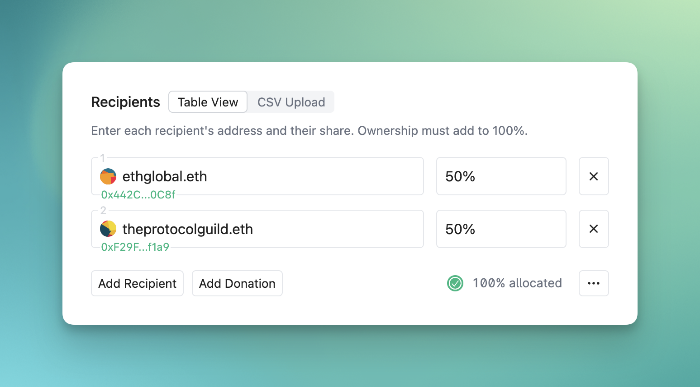
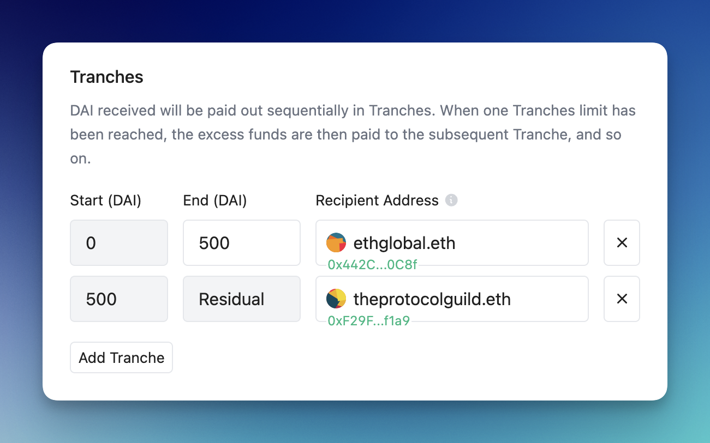
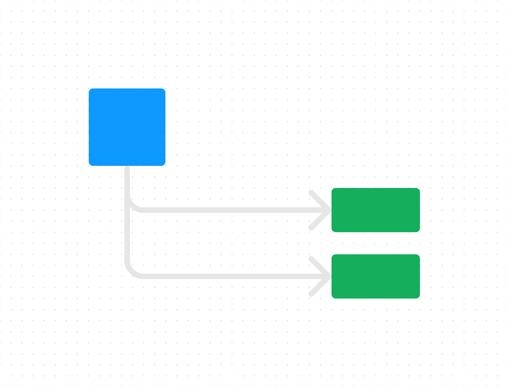
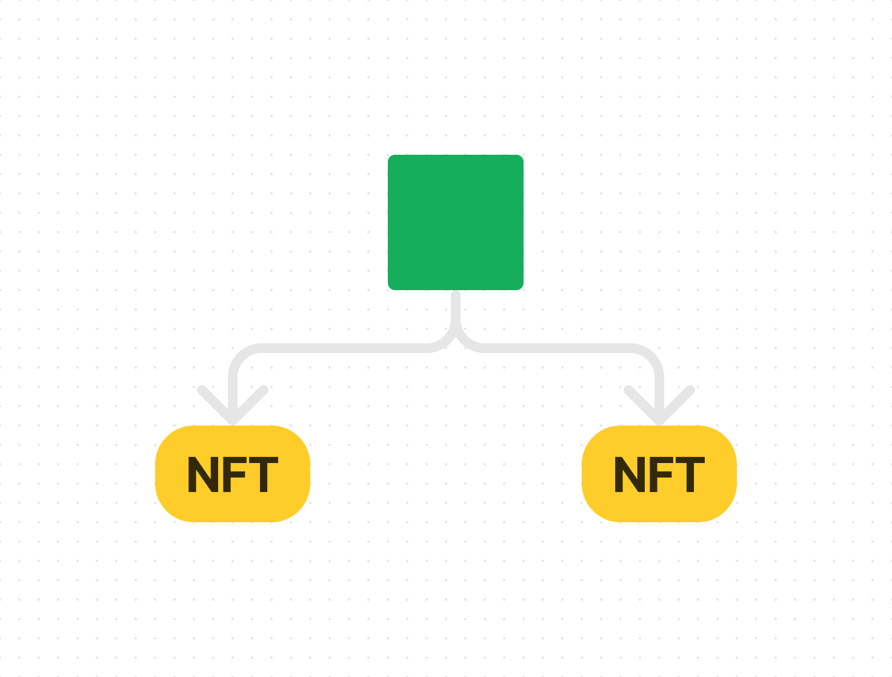
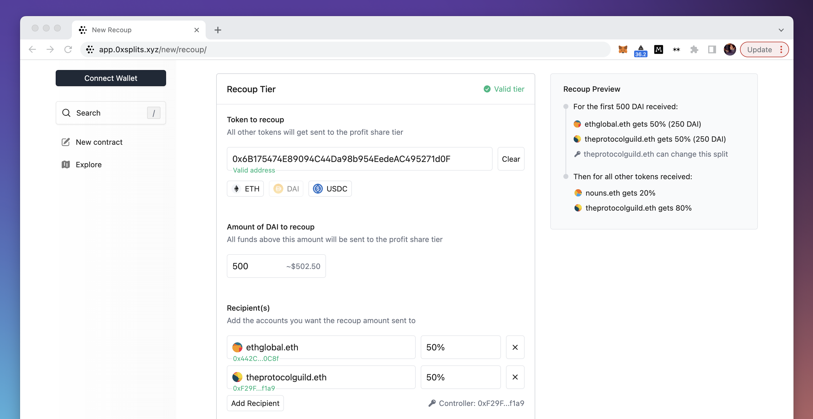

# Creating contracts

If you haven't already, we recommend you read the [flow of funds](/flow) page to
understand how funds move through the system and the various steps.

## Building blocks

There are three core smart contract building blocks upon which all payment flows
within 0xSplits are created: Split, Waterfall, and Vesting. You can stack these
blocks together in whatever order makes sense for your specific needs. These
building blocks are intentionally unopionated, however, for more opinionated
payment flows we've also created [Templates](#templates), which stack stack
frequently used blocks together.

import { Card, Cards } from 'nextra-theme-docs'

<Cards num={2}>

<Card image title="Split" href="#split">
  <></>
</Card>
<Card image title="Waterfall" href="#waterfall">
  <></>
</Card>

</Cards>

### Split

A Split is a smart contract that distributes funds according to pre-set
percentages. It's an **equity-like structure** that can be plugged into any
payment flow you need. To create one, just enter in two or more recipients and
make sure shares add to 100%.

You also have the option to set an admin if you anticipate the Split needing to
change in the future. Note that the admin has complete authority to
add/remove/modify recipients and even change or remove the admin at anytime. You
can make the admin any address, including a smart contract like a
[Gnosis Safe](https://safe.global/). Unless you know the Split will need to
change, we recommend not adding an admin since **a Split is only as trustworthy
as the admin**.

- [Create a Split](https://app.0xsplits.xyz/new/split)
- [Technical docs](/contracts/core/split)
- [Contracts](https://github.com/0xSplits/splits-contracts)

### Waterfall

A Waterfall allows you to define the order & amount different accounts are paid.
It is a **debt-like structure** that is useful whenever one account shoud be
paid _before_ another account. You can pair Waterfall with Splits, and the
[Recoup template](#recoup) makes this easy.

A Waterfall has multiple levels called tranches, each with a limit and a
recipient. The limit is the highest amount the recipient can get, and they
receive it only when the previous tranche limit is reached. This pattern
continues until all the tranches are filled, at which point any extra funds go
to the final tranche recipient.

- [Create a Waterfall](https://app.0xsplits.xyz/new/waterfall)
- [Technical docs](/contracts/core/waterfall)
- [Contracts](https://github.com/0xSplits/splits-waterfall)

## Templates

Templates are pre-build payment flows that stack two or more building blocks
together. Since these are opinionated flows, each template has a dedicated
creation form and account detail view in the app.

<Cards num={2}>

<Card title="Recoup &rarr;" image href="#recoup">
  <></>
</Card>
<Card title="Liquid Split &rarr;" image href="#liquid-split">
  <></>
</Card>

</Cards>

### Recoup

Recoup allows you to repay one group before splitting profits with another. It
makes it easy to create a Waterfall that points to a number of Splits. This is
particularly useful if you want to repay one group before splitting profits with
another. Just enter in the token and amount you wish to recoup, and then add
recipients for each tier. As long as there are two or more recipients in a tier,
the Recoup will automatically deploy the necessary Split(s) upon creation.

- [Create a Recoup](https://app.0xsplits.xyz/new/recoup)
- [Technical docs](/contracts/templates/recoup)
- [Contracts](https://github.com/0xSplits/splits-recoup)

### Liquid Split

A Liquid Split utilizes NFTs to represent ownership in a Split. This enables
recipients to transfer their shares to others. This works by combining an
ERC-1155 NFT contract with a Split, and making the NFT contract the admin of the
Split. Whenever funds are distributed within the Split, it looks at the holders
of the NFTs and updates the recipients accordingly.

When you create a Liquid Split, just specify the _initial_ recipients and create
the Split as you normally would. Upon creation, each recipient will receive
their portion of the 1,000 NFTs minted. For example, if Alice is a 20%
recipient, they will receive 200 NFTs (20% of 1,000 = 200). Alice can then
transfer their shares however they want.

- [Create a Liquid Split](https://app.0xsplits.xyz/new/split/?type=liquid)
- [Technical docs](/contracts/templates/liquid)
- [Contracts](https://github.com/0xSplits/splits-liquid)
