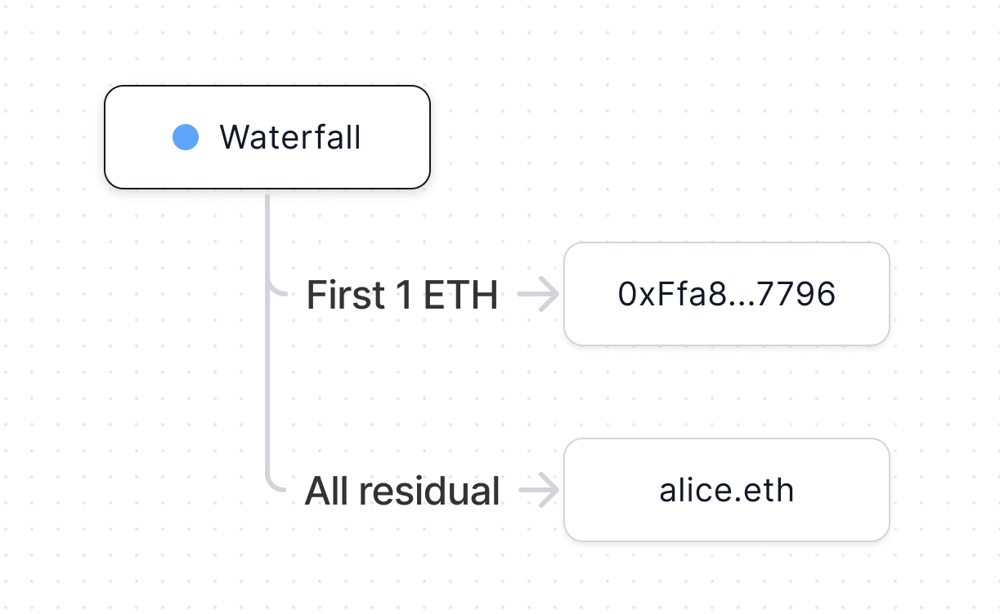
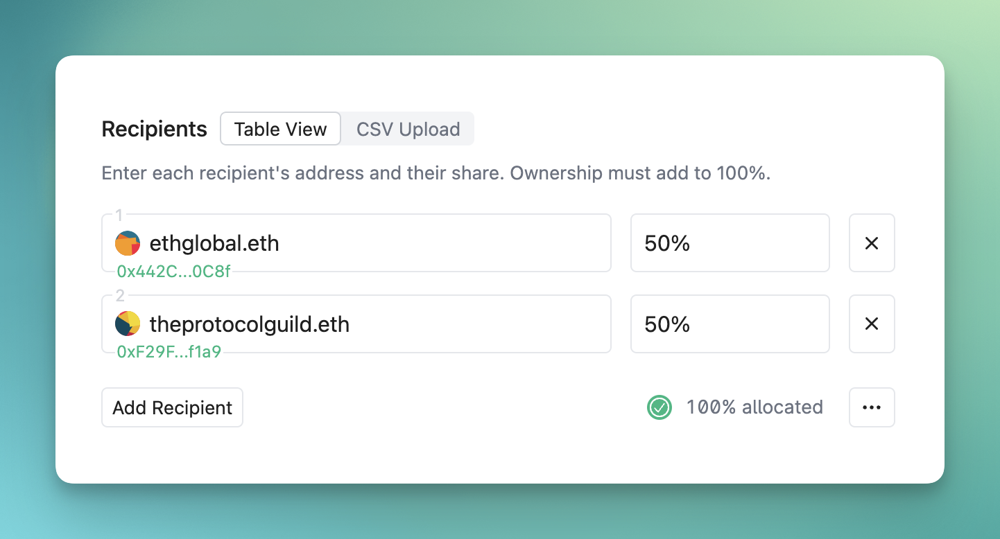

# Creating contracts

Before jumping into the different types of contracts you can create, there are a
few important concepts that apply to all of the contracts in the 0xSplits
ecosystem.

- **Contract address:** Each contract has an address that can receive ETH and
  ERC20 tokens. You can use this address anywhere you want funds distributed
  according to the rules you've configured, including as a recipient of other
  contracts you create.
- **Recipient:** Each contract has at least one recipient, to whom funds are
  transferred from the contract. A recipient can be any
  [Ethereum account](https://ethereum.org/en/developers/docs/accounts/) that is
  capable of receiving ETH and ERC20 tokens. Smart contracts can be designated
  as recipients since there is no need for recipients to manually withdraw funds
  themselves.
- **Balance:** This is the quantity of a particular token that is presently held
  within a contract. When tokens are received by a contract, they are kept as a
  balance until they are distributed. Balances are unique to each type of token,
  and a contract can have several balances. For instance, if a Split receives
  both ETH and DAI, it will have a balance for ETH and a balance for DAI.

- **Distribution:** Because all of the contracts follow a
  [pull-based payment flow](https://consensys.github.io/smart-contract-best-practices/development-recommendations/general/external-calls/#favor-pull-over-push-for-external-calls),
  balances must be distributed before recipients can withdraw their funds. Each
  balance only needs to be distributed once in order for all recipients to
  withdraw.

## Building blocks

There are three core building blocks upon which all payment flows are created:
Split, Waterfall, and Vesting. You can stack these blocks together in whatever
order makes sense for your specific needs.

import { Card, Cards } from 'nextra-theme-docs'

<Cards>

<Card title="Split &rarr;" image href="#split">
  
</Card>
<Card title="Waterfall &rarr;" image href="#waterfall">
  
</Card>
<Card title="Vesting &rarr;" image href="#vesting">
  
</Card>

</Cards>

### Split

A Split is a building block that distributes funds according to pre-set
percentages. To create one, all you have to do is enter in two or more
recipients and assign each one an ownership percentage.

You have the option to set a controller if you anticipate the Split needing to
change in the future. The controller has the ability to add/remove/modify
recipients and even transfer control of the Split to a new account (or remove
control entirely). **A Split is only as trustworthy as the controller** so use
with caution.

### Waterfall

A Waterfall allows you to define the order & amount different accounts are paid.
This is useful when one account shoud be paid _before_ another account. For
example, an NFT project may choose to repay expenses before splitting profits.

A Waterfall has multiple levels called tranches, each with a limit and a
recipient. The limit is the highest amount the recipient can get, and they
receive it only when the previous tranche limit is reached. This pattern
continues until all the tranches are filled, at which point any extra funds go
to the last tranche recipient.

### Vesting

Vesting is a contract that releases streams of funds to a recipient over a set
period of time. When creating a Vesting contract, all you need to do it set the
recipient and the number of days it takes for each vesting stream to complete.

Since there is no way to revoke a vesting stream once it's begun, this is best
paired with a mutable Split since this combination allows the end recipients to
change. Check out the
[Protocol Guild](https://app.0xsplits.xyz/accounts/0xF29Ff96aaEa6C9A1fBa851f74737f3c069d4f1a9/)
to see this setup in action.

## Templates

Templates are pre-build payment flows that stack two or more building blocks
together. Each template has a dedicated creation flow and detail view within the
app.

<Cards>

<Card title="Recoup &rarr;" image href="#split">
  
</Card>
<Card title="Liquid Split &rarr;" image href="#waterfall">
  
</Card>

</Cards>

### Recoup

Recoup allows you to repay one group before splitting profits with another. It
makes it easy to create a Waterfall that points to a number of Splits.

### Liquid Split

A Liquid Split utilizes NFTs to signify ownership in a Split. This enables
recipients to transfer their shares to others. When the NFTs are transferred,
the Split recipients are updated to show the current NFT ownership. By default,
when creating a Liquid Split, each initial recipient will receive their share of
the 1,000 ERC-1155 NFTs created.
