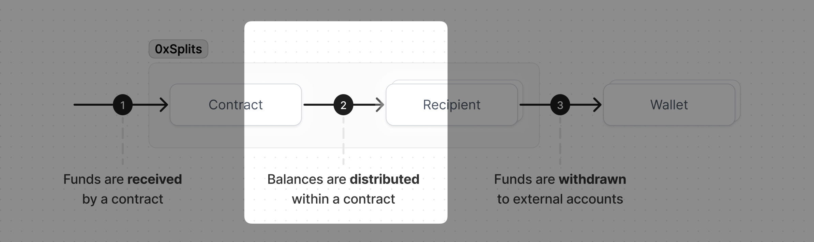

# Distributing balances

All ETH and ERC20 tokens sent to a contract are stored in the contract as a
balance until that balance is distributed. When a balance is distributed, the
funds are allocated to each recipient according to the contract's rules.

For example, in a Split contract, when a distribution happens the balance is
divided among the recipients according to each one's ownership percentage.
Whereas in a Waterfall contract, a distribution allocates the balance
sequentially by only sending funds to a recipient once the preceeding tranche
has been filled. More about this step can be found [here](/flow#distributing).

## Locating balances

To view a contract's balances, navigate to the contract's detail page and look
in the Earnings section on the right side. A balance will show $0.00 if we were
unable to find an accurate USD price for that token.

## Distributing balances

Since distributing balances requires you to submit a transaction, you'll first
have to connect your wallet. Once you're connected you can select the balance(s)
you wish to distribute and then choose what type of distribution to make. There
are a few options:

1. **Distribute**: this will _just_ distribute the balance and make it claimable
   by recipients. Once this is done, each recipient can withdraw at their
   leisure.
2. **Distribute and withdraw for all**: this will first distribute the balance
   and then immediately withdraw that balance for each recipient. When you do
   this, you are "pushing" the balance to each recipient and saving them the
   need to withdraw themselves.
3. **Distribute and withdraw for myself**: this option will only be visible if
   you are a recipient in the contract. It works just like #2, except it only
   withdraws for yourself instead of all recipients.

## Distribution bounty

Even though balances can be distributed by anyone at anytime, it often makes
sense to add a distribution bounty to encourage bots to distribute balances so
humans don't have to. When a contract has a distribution bounty attached to it,
you will be able to see it just above the list of balances.

This bounty is a percentage of the total amount being distributed and is paid to
whoever distributes the balance. For example, if there is a balance of \$300 USD
and a 1% bounty, whoever distributes the balance will receive \$3 (1% of \$300
is \$3). As long as the gas needed to distribute this balance is less than \$3,
it's economically viable to make this distribution.

## Confirming distributions

After a balance has been distributed, you'll be able to see exactly how much
each recipient earned by looking in the Activity feed. Locate the distribution
in question and click on the `v` icon to view the details. You can share this
with others by copying the activity feed item's URL to your keyboard or share
the Etherscan link.

