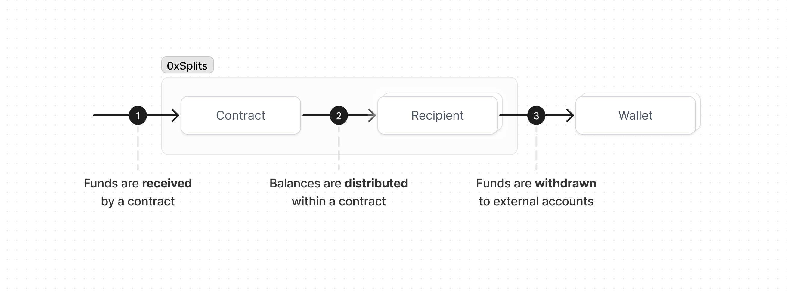

import { Toggle } from '../components/toggle'

# Flow of funds

There are three steps by which funds flow through the system to end recipients.

## Receiving

ETH and ERC20 tokens can be sent directly to any of the contracts simply by
using the contract's address. You can paste this address into any third-party
platform or contract, including exchanges and others with hard gas limits. Funds
received by a contract will be stored as a balance until a distribution occurs.
You can learn more technical details about sending funds to a contract [here](/core).

## Distributing

When a distribution occurs, funds sitting in the contract's balance will be
allocated to each recipient's account in the protocol according to the rules of
the contract. For example, when a Split is distributed the funds are allocated
according to pre-defined percentages, whereas when a Waterfall is distributed
funds are allocated sequentially according to the payout schedule.

Instructions for distributing balances using the app are found in the help center,
however, most people won't need to worry about this step since any contract with
a bounty will eventually be distributed automatically by a bot or arbitrageur.

<Toggle title="Why is this step necessary?">
  The distribution step exists to maximize **composability and reliability**.
  The alternative, where funds are "pushed" to end recipients immediately upon
  being received by the contract, is expensive, unreliable, and insecure.
  Industry best practices recommend following a pull model, particularly when it
  comes to payments.[^1] [^2] This added step is mitigated by adding a bounty on
  the contract to incentivize third parties to execute distributions automatically.
</Toggle>

## Withdrawing

Once a contract's balance has been distributed, funds are ready to be withdrawn
to any of the recipients' wallets. Since funds pile up in one place, withdrawing
transfers _all the funds_ across _all the contracts_ for a given recipient. This
saves people from having to initiate separate withdrawals for each contract they
earn from. Since anyone can withdraw on behalf of any recipient ([instructions](https://splits.org/help/withdraw-balances/)
), recipients can be any account, smart contract, or exchange address.

<Toggle title="Why is this step necessary?">
  In addition to being more secure (discussed above), this step maximizes **gas
  efficiency** for recipients. By putting all the funds in one place, in a
  single transaction you're able to withdraw all your funds across all the
  contract you earn from. The alternative, where funds are sent to each
  recipient during a distribution, would use significantly more gas per
  distribution and limit the number of recipients a contract can have. With this
  pull-based withdraw step, the longer you wait to withdraw your funds, the more
  funds pile up, and the more gas you save.
</Toggle>

 
 
[^1]: [Smart contract best
practices](https://consensys.github.io/smart-contract-best-practices/development-recommendations/general/external-calls/#favor-pull-over-push-for-external-calls)

[^2]:
    [Pull over push](https://fravoll.github.io/solidity-patterns/pull_over_push.html)
