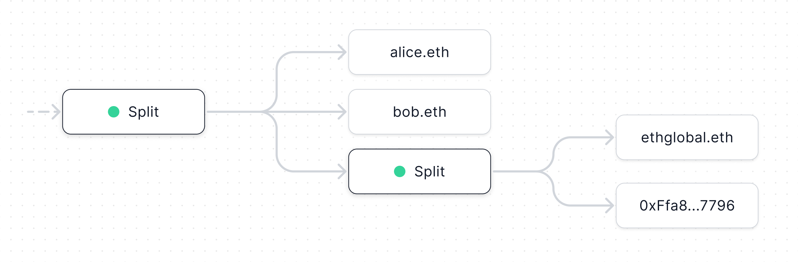

# Docs

  Learn how Splits is used to manage onchain revenue

Splits is a set of composable,
[open-source](https://etherscan.io/address/0x2ed6c4b5da6378c7897ac67ba9e43102feb694ee#code),
and
[audited](https://github.com/0xSplits/splits-contracts/blob/main/audit/0xSplits_A-1.pdf)
smart contracts that make it easy to manage onchain revenue. Running exactly at
gas and charging no protocol fees, it takes the form of a
[hyperstructure](https://jacob.energy/hyperstructures.html) that will run for
free, forever, without any maintenance or trusted third parties.

These docs are designed for technical users. If you're non-technical, new to Ethereum, or
just want to understand how you can use Splits today, we recommend you check out our
[help center](https://splits.org/help/).

## Features

- Free: No protocol fees – runs exactly at gas cost
- Unstoppable: Non-upgradable contracts run as long as the underlying network
  exists
- Multichain: Deployed on Ethereum, Optimism, Base, Zora, Polygon, Arbitrum + more
- Open source: All contracts are
  [verified](https://etherscan.io/address/0x2ed6c4b5da6378c7897ac67ba9e43102feb694ee#code),
  [audited](https://github.com/0xSplits/splits-contracts/blob/main/audit/0xSplits_A-1.pdf),
  and publicly available on [Github](https://github.com/0xSplits)
- Composable: Each contract has a payable address to receive ETH and ERC20
  tokens
- Efficient: Batched operations maximize gas efficiency at every step
- Onchain: No third party APIs or external dependencies
- Fair: Distribution costs are shared so small recipients aren't screwed
- Automated: Bots and third parties may be incentivized to perform the repetitive tasks

## Usage

Teams, platforms, and projects of all sizes rely on Splits to manage or help their users manage
their onchain revenue.

- Platforms: Zora, fxhash, Sound, Art Blocks, SuperRare, Titles, Arpeggi, Bonfire,
  1stDibs
- Collectives: Protocol Guild, Metalabel, Songcamp, Heds
- Musicians: Daniel Allan, Reo Cragun, Coop Records, LNRZ, Venice Music
- DAOs: Nouns, Airswap, MOROS NET, Bankless, GCR
- Studios: Transient Labs, Props, Quantum

## Values

We hope that sharing our values publicly will help you understand why the system
is designed the way it is.

- **Do one thing and do it well**. Empowering creative teams with simple, clear,
  and modular tools is the best way to create enduring value in the ecosystem.
- **Trust is hard to build and easy to lose**. Security of the system is the
  highest order bit, and the system is only as secure as the foundation upon
  which it is built.
- **Growing the pie matters more than growing the slice**. Composability within
  the ecosystem is the lifeblood of growth since it's experimentation at the
  edges where the most compelling discoveries happen.
- **Tools must be credibly neutral**. This means they're rule-based, verifiable
  & open source, easy to understand, simple, and hard—if not impossible—to
  change.
- **There are no solutions, only tradeoffs**. Considerations are
  context-specific and because something works in one situation does not mean it
  works in all.

Join us on [Discord](https://chat.splits.org/) to learn more and let us know
what you think. We're a small, funded, growing team of developers focused on
this full time and would love to hear from you.
