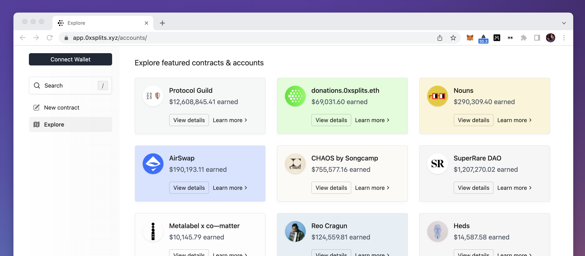
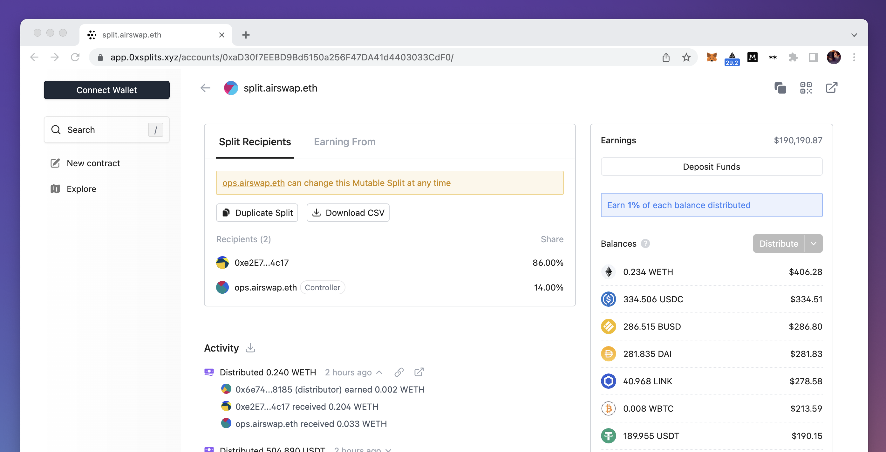
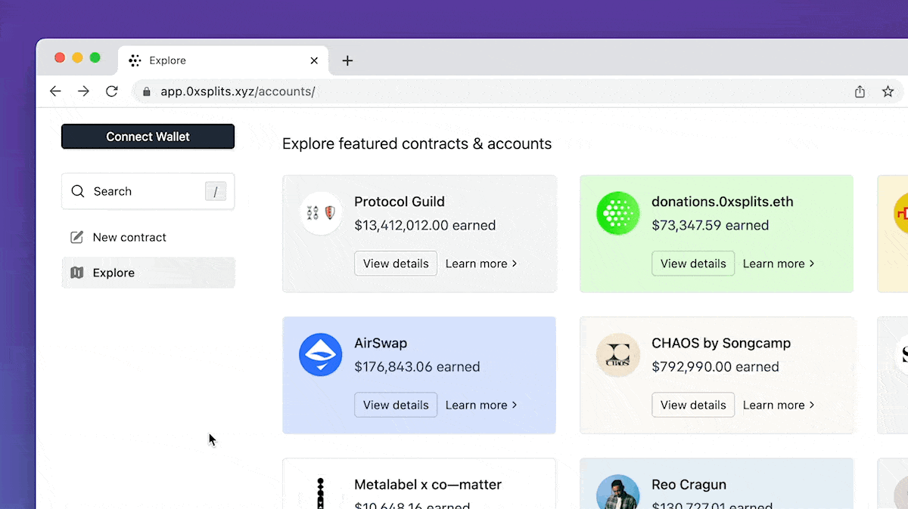
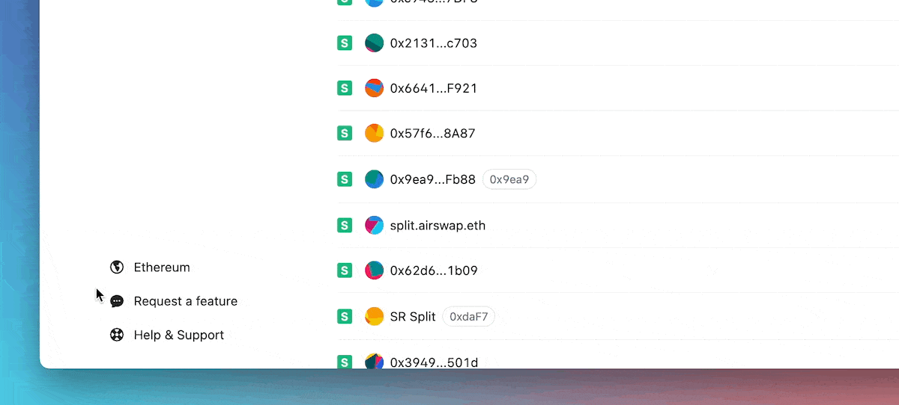
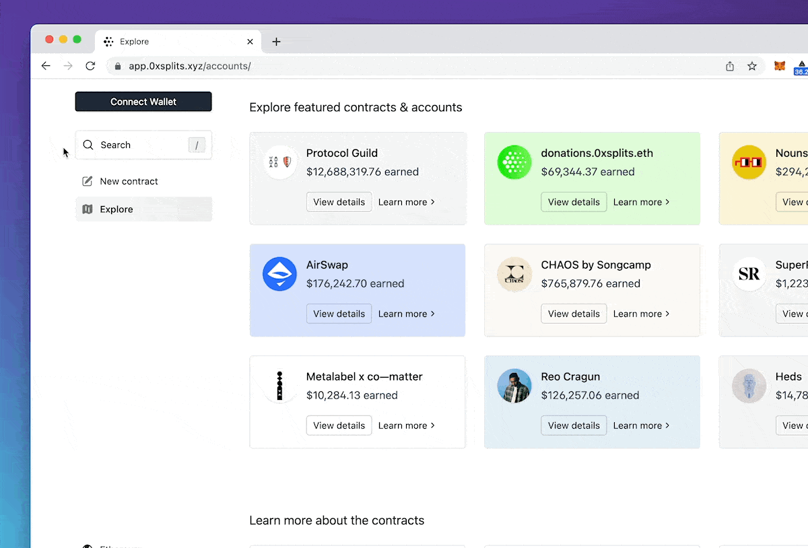
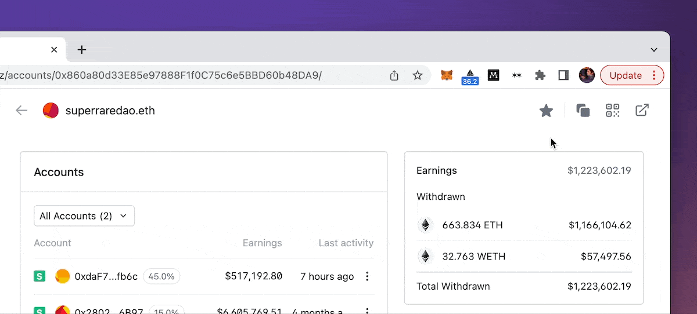
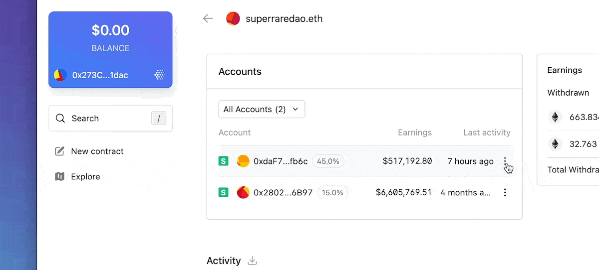
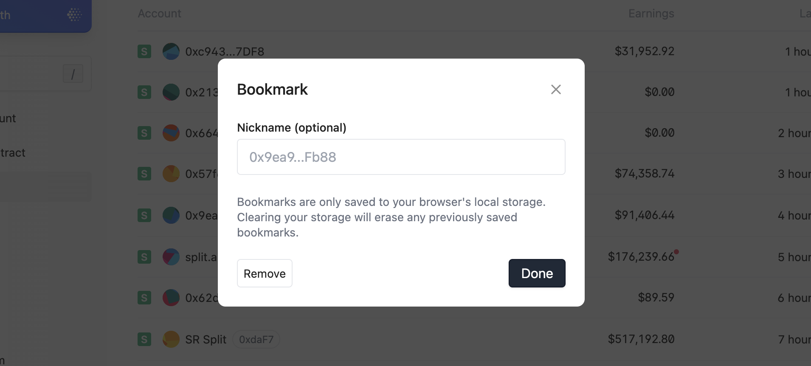

# Getting started

You can access the app by going to
[app.0xsplits.xyz](https://app.0xsplits.xyz/). You can play around with the app
and get a feel for what it's like to create a contract without connecting your
wallet. However, you will need to connect your wallet in order to submit a
transaction like deploying a contract, withdrawing a balance, and so on.

When you first open the app, you'll be brought to the Explore page. This page
gives you an idea of the activity happening in the ecosystem and how projects &
teams are using Splits in different ways today. You can click in to view the
account page for these various projects & people, or click "Learn more" to read
about how these groups have integrated Splits into their payment flows.

## Account page

Clicking on an account will bring you to the detail page. On this page, in the
top you can see the account address in the top left and options to share in the
top right.

The left column shows the details of this account. If it's a Spilt, you'll see
the recipients, and if it's a Waterfall or Vesting contract, you'll see those
details here also. Below this you will find the Activity feed, which will
highlight all distributions and activity pertaining to this account.

In the right column, you'll see an Earnings section. This section highlights all
the tokens this account has earned through the Splits ecosystem.

## Search

If you're looking for a specific person or contract, the easiest way to find
that is through search. Either hit `/` on your keyboard or click the search
button in the sidebar. Then paste in the address or type in an ENS and hit
enter.

## Switching networks

Regardless of whether your wallet is connected or not, you can switch what
network the app is on using the network selector in the bottom of the sidebar.

## Connect your wallet

Connecting your wallet to the app allows you to submit transactions and see
content that's specific to your wallet – things like your balances, contracts
you're earning from, and more. Click Connect Wallet in the sidebar and choose
your wallet provider.

If you're using a **Gnosis Safe**, we recommend you use the
[Gnosis 0xSplits](https://app.safe.global/share/safe-app?appUrl=https%3A%2F%2Fapp.0xsplits.xyz&chain=eth)
app for the best experience, however, you can connect directly using
WalletConnect.

## Bookmarks

Once you've connected your wallet, you'll be able to bookmark any account in the
app. Similar to bookmarks in your web browser, bookmarking an account makes it
easier to find. There are two ways to add a bookmark.

The first is to navigate to the account's detail page and click the star icon in
the top right corner.

The second is to click the `︙` button on the right side of an account preview,
and select "Add bookmark".

Both of these options will open the bookmark dialog, which allows you to add a
name to the bookmark. Naming a bookmark will replace this account's address with
the bookmark name everywhere you see it in the app (including search).

Bookmarks are only stored to your browser's local storage, meaning they're never
saved to a server and will not sync between devices. Bookmarks are also saved at
the account and network level, meaning if you change networks or connected
wallets, your bookmarks will not transfer.

To remove a bookmark, follow the same steps as above and hit "Remove" in the
bottom left corner of the bookmark dialog.
