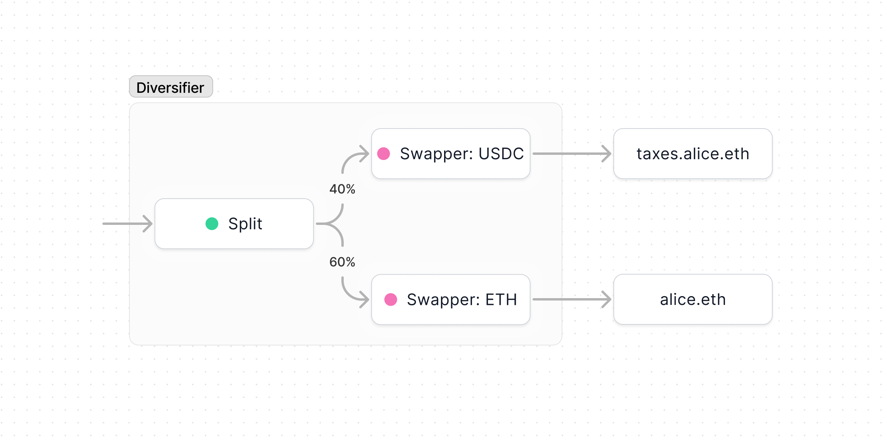
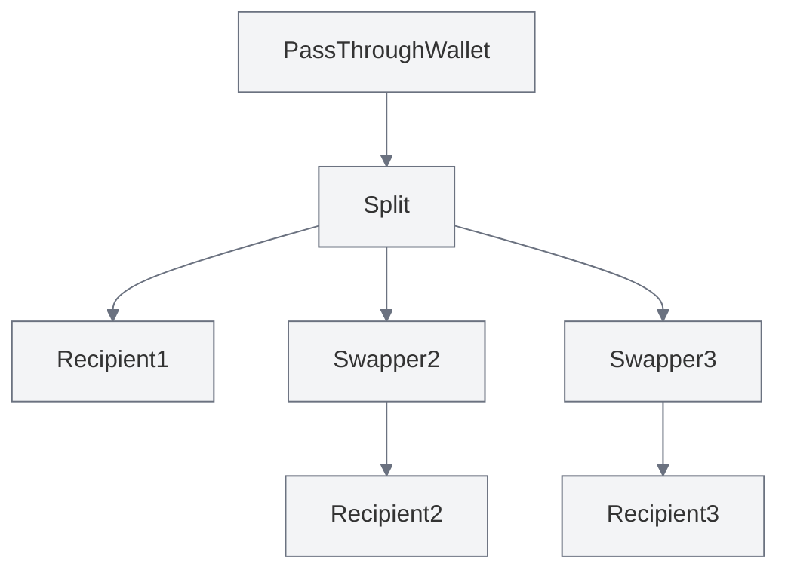

import { Toggle } from '../../components/toggle'
import { Tab, Tabs } from 'nextra-theme-docs'

# Diversifier

Diversifier is a smart contract that automatically diversifies an income stream
into specific tokens of various ratios. This is particularly useful for tax
withholdings, for example when you want to automatically swap 40% of your income
into a stablecoin and set aside for taxes. This template simply stacks a
[Pass-Through Wallet](/core/pass-through) on top of a [Split](/core/split) on
top of a number of [Swappers](/core/swapper).

- [Creation form](https://app.splits.org/new/diversifier/)
- [Github](https://github.com/0xSplits/splits-diversifier)
- [Contracts & Natspec](https://github.com/0xSplits/splits-diversifier/tree/main/src)
- Related: [Split](/core/split), [Swapper](/core/swapper),
  [Pass-Through Wallet](/core/pass-through)

## How it works

- Each Diversifier is a payable smart contract that uses a Split to
  automatically split incoming tokens according to pre-set percentages.
  Recipients of the Split may be Swappers to automatically swap tokens into a
  specified output tokens. A Pass-Through Wallet sits on top and owns / controls
  all of the underlying modules, allowing the Diversifier to function as a full
  wallet. That's all there is to it, so if that sounds complicated we recommend
  you review the Split, Swapper, and Pass-Through Wallet contracts.
- Each Diversifier can be owned, which means the owner has full control of the
  deployment. The owner may modify the Split, change the oracles and discounts,
  pause the Swappers, and execute arbitrary transactions at their will. We
  recommend removing the owner or making it a multisig if this contract is being
  used in any trustless setting.

## Addresses

<Tabs items={['Mainnets', 'Testnets']}>

<Tab>

<Toggle title="Ethereum – 1">

| Contract | Address                                                                                                                      |
| :------- | :--------------------------------------------------------------------------------------------------------------------------- |
| Factory  | [`0x78791997483f25217F4C3FE2a568Fe3eFaf77884`](https://etherscan.io/address/0x78791997483f25217F4C3FE2a568Fe3eFaf77884#code) |

</Toggle>

<Toggle title="Base – 8453">

| Contract | Address                                                                                                                      |
| :------- | :--------------------------------------------------------------------------------------------------------------------------- |
| Factory  | [`0x1f3f5C7342Ae19E2b35b657864106f227201eF8A`](https://basescan.org/address/0x1f3f5C7342Ae19E2b35b657864106f227201eF8A#code) |

</Toggle>

<Toggle title="Optimism – 10">

| Contract | Address                                                                                                                                 |
| :------- | :-------------------------------------------------------------------------------------------------------------------------------------- |
| Factory  | [`0x1f3f5C7342Ae19E2b35b657864106f227201eF8A`](https://optimistic.etherscan.io/address/0x1f3f5C7342Ae19E2b35b657864106f227201eF8A#code) |

</Toggle>

<Toggle title="Polygon – 137">

| Contract | Address                                                                                                                         |
| :------- | :------------------------------------------------------------------------------------------------------------------------------ |
| Factory  | [`0x1f3f5C7342Ae19E2b35b657864106f227201eF8A`](https://polygonscan.com/address/0x1f3f5C7342Ae19E2b35b657864106f227201eF8A#code) |

</Toggle>

<Toggle title="Arbitrum – 42161">

| Contract | Address                                                                                                                     |
| :------- | :-------------------------------------------------------------------------------------------------------------------------- |
| Factory  | [`0x1f3f5C7342Ae19E2b35b657864106f227201eF8A`](https://arbiscan.io/address/0x1f3f5C7342Ae19E2b35b657864106f227201eF8A#code) |

</Toggle>

</Tab>

<Tab>

<Toggle title="Goerli – 5">

| Contract | Address                                                                                                                             |
| :------- | :---------------------------------------------------------------------------------------------------------------------------------- |
| Factory  | [`0x78791997483f25217F4C3FE2a568Fe3eFaf77884`](https://goerli.etherscan.io/address/0x78791997483f25217F4C3FE2a568Fe3eFaf77884#code) |

</Toggle>

<Toggle title="Sepolia – 11155111">

| Contract | Address                                                                                                                              |
| :------- | :----------------------------------------------------------------------------------------------------------------------------------- |
| Factory  | [`0x0eAeAfD1c82563B6005c7D09031462D9FF68Adab`](https://sepolia.etherscan.io/address/0x0eAeAfD1c82563B6005c7D09031462D9FF68Adab#code) |

</Toggle>

</Tab>

</Tabs>
