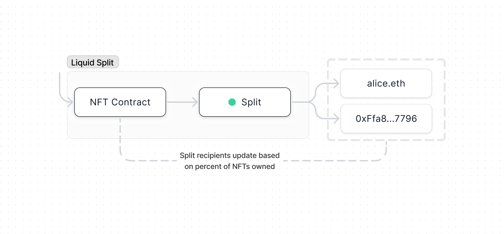

import { Toggle } from '../../components/toggle'
import { Tab, Tabs } from 'nextra-theme-docs'
import { Callout } from 'nextra-theme-docs'

# Liquid Split

Unlike standard Splits where ownership is manually controlled, Liquid Splits use
NFTs to make ownership transferable. This allows each recipient to control their
share of the Split themselves. This template uses an ERC-1155 NFT contract and a
mutable [Split](/core/split). You can integrate Liquid Splits into your own NFT
project (including adding your own artwork etc) by forking
[this repo](https://github.com/0xSplits/splits-liquid-template).

- [Creation form](https://app.splits.org/new/split/?type=liquid)
- [Contracts & NatSpec](https://github.com/0xSplits/splits-liquid/tree/master/src)
- [Github](https://github.com/0xSplits/splits-liquid)
- [SDK](/sdk/liquid)
- [Example](https://app.splits.org/accounts/0x8427e46826a520b1264B55f31fCB5DDFDc31E349/)
- Related: [Split](/core/split),
  [ERC-1155](https://ethereum.org/en/developers/docs/standards/tokens/erc-1155/)

<Callout type="warning" emoji="⚠️">
  When adding this functionality to your contracts, if `sum(percentAllocations)
  != 1e6` the Split will fail to update and funds will be stuck! Be careful when
  managing supply (including burns, rounding on odd numbers, etc). For this
  reason there is no burn function exposed in our implementation.
</Callout>

## How It Works

- When a Liquid Split is created, an ERC-1155 contract is deployed and 1,000
  NFTs are minted to the initial recipients with each recipient receiving their
  share of the NFTs. The ERC-1155 contract is then set as the controller for a
  mutable Split. Funds pile up in the Liquid Split contract (which is the
  ERC-1155 contract) and whenever a balance is distributed the NFT contract
  updates the Split to match current NFT holders and immediately distributes the
  balance. This is done by calling
  [`updateAndDistribute`](https://github.com/0xSplits/splits-contracts/blob/main/contracts/SplitMain.sol#L410).
- NFTs should only be considered to represent funds that _have not yet been
  received by the Liquid Split_. Because recipients of a Liquid Split are
  updated at the time of a distribution, it is unsafe to assume that acquiring
  Liquid Split NFTs will entitle someone to any portion of the current balance.
  A seller could easily distribute the balance right before transferring you the
  shares, causing them to receive that portion of the balance.
- We recommend setting the distribution incentive on Liquid Splits to be
  slightly higher (i.e., ~2-3% instead of ~1%). This is because distributions
  require more gas given the need to both update and distribute the Split.
- The ERC-1155 standard was used since it allows batch transfers. This means
  that someone can transfer 1% of the Split (10 NFTs) in a single transaction
  instead of 10 separate ones (which would be required if using the ERC-721
  standard).

## Addresses

<Tabs items={['Mainnets', 'Testnets']}>

<Tab>

<Toggle title="Ethereum - 1">

| Contract       | Address                                                                                                                      |
| :------------- | :--------------------------------------------------------------------------------------------------------------------------- |
| Implementation | [`0xb7d1fd59f072509ae4e2eb0628805524b2476371`](https://etherscan.io/address/0xb7d1fd59f072509ae4e2eb0628805524b2476371#code) |
| Factory        | [`0xdecd8b99b7f763e16141450daa5ea414b7994831`](https://etherscan.io/address/0xdecd8b99b7f763e16141450daa5ea414b7994831#code) |

</Toggle>

<Toggle title="Optimism – 10">

| Contract       | Address                                                                                                                                 |
| :------------- | :-------------------------------------------------------------------------------------------------------------------------------------- |
| Implementation | [`0xb7d1fd59f072509ae4e2eb0628805524b2476371`](https://optimistic.etherscan.io/address/0xb7d1fd59f072509ae4e2eb0628805524b2476371#code) |
| Factory        | [`0xdecd8b99b7f763e16141450daa5ea414b7994831`](https://optimistic.etherscan.io/address/0xdecd8b99b7f763e16141450daa5ea414b7994831#code) |

</Toggle>

<Toggle title="BSC – 56">

| Contract       | Address                                                                                                                     |
| :------------- | :-------------------------------------------------------------------------------------------------------------------------- |
| Implementation | [`0x306306EB890B79bA98CFF84a1637e2B64c4092b4`](https://bscscan.com/address/0x306306EB890B79bA98CFF84a1637e2B64c4092b4#code) |
| Factory        | [`0xCDe071bE119024EdC970B3Da15003ee834ae40D2`](https://bscscan.com/address/0xCDe071bE119024EdC970B3Da15003ee834ae40D2#code) |

</Toggle>

<Toggle title="Gnosis – 100">

| Contract       | Address                                                                                                                       |
| :------------- | :---------------------------------------------------------------------------------------------------------------------------- |
| Implementation | [`0xb7d1fd59f072509ae4e2eb0628805524b2476371`](https://gnosisscan.io/address/0xb7d1fd59f072509ae4e2eb0628805524b2476371#code) |
| Factory        | [`0xdecd8b99b7f763e16141450daa5ea414b7994831`](https://gnosisscan.io/address/0xdecd8b99b7f763e16141450daa5ea414b7994831#code) |

</Toggle>

<Toggle title="Polygon – 137">

| Contract       | Address                                                                                                                         |
| :------------- | :------------------------------------------------------------------------------------------------------------------------------ |
| Implementation | [`0xb7d1fd59f072509ae4e2eb0628805524b2476371`](https://polygonscan.com/address/0xb7d1fd59f072509ae4e2eb0628805524b2476371#code) |
| Factory        | [`0xdecd8b99b7f763e16141450daa5ea414b7994831`](https://polygonscan.com/address/0xdecd8b99b7f763e16141450daa5ea414b7994831#code) |

</Toggle>

<Toggle title="Fantom – 250">

| Contract       | Address                                                                                                                     |
| :------------- | :-------------------------------------------------------------------------------------------------------------------------- |
| Implementation | [`0xb7d1fd59f072509ae4e2eb0628805524b2476371`](https://ftmscan.com/address/0xb7d1fd59f072509ae4e2eb0628805524b2476371#code) |
| Factory        | [`0xdecd8b99b7f763e16141450daa5ea414b7994831`](https://ftmscan.com/address/0xdecd8b99b7f763e16141450daa5ea414b7994831#code) |

</Toggle>

<Toggle title="Base – 8453">

| Contract       | Address                                                                                                                         |
| :------------- | :------------------------------------------------------------------------------------------------------------------------------ |
| Implementation | [`0xb7d1fd59f072509ae4e2eb0628805524b2476371`](https://basescan.org/address/0xb7d1fd59f072509ae4e2eb0628805524b2476371#code) |
| Factory        | [`0xdecd8b99b7f763e16141450daa5ea414b7994831`](https://basescan.org/address/0xdecd8b99b7f763e16141450daa5ea414b7994831#code) |

</Toggle>

<Toggle title="Arbitrum – 42161">

| Contract       | Address                                                                                                                     |
| :------------- | :-------------------------------------------------------------------------------------------------------------------------- |
| Implementation | [`0xb7d1fd59f072509ae4e2eb0628805524b2476371`](https://arbiscan.io/address/0xb7d1fd59f072509ae4e2eb0628805524b2476371#code) |
| Factory        | [`0xdecd8b99b7f763e16141450daa5ea414b7994831`](https://arbiscan.io/address/0xdecd8b99b7f763e16141450daa5ea414b7994831#code) |

</Toggle>

<Toggle title="Avalanche – 43114">

| Contract       | Address                                                                                                                      |
| :------------- | :--------------------------------------------------------------------------------------------------------------------------- |
| Implementation | [`0xb7d1fd59f072509ae4e2eb0628805524b2476371`](https://snowtrace.io/address/0xb7d1fd59f072509ae4e2eb0628805524b2476371#code) |
| Factory        | [`0xdecd8b99b7f763e16141450daa5ea414b7994831`](https://snowtrace.io/address/0xdecd8b99b7f763e16141450daa5ea414b7994831#code) |

</Toggle>

<Toggle title="Zora – 7777777">

| Contract       | Address                                                                                                                         |
| :------------- | :------------------------------------------------------------------------------------------------------------------------------ |
| Implementation | [`0xb7d1fd59f072509ae4e2eb0628805524b2476371`](https://explorer.zora.energy/address/0xb7d1fd59f072509ae4e2eb0628805524b2476371?tab=contract) |
| Factory        | [`0xdecd8b99b7f763e16141450daa5ea414b7994831`](https://explorer.zora.energy/address/0xdecd8b99b7f763e16141450daa5ea414b7994831?tab=contract) |

</Toggle>

<Toggle title="Aurora – 1313161554">

| Contract       | Address                                                                                                                        |
| :------------- | :----------------------------------------------------------------------------------------------------------------------------- |
| Implementation | [`0xb7d1fd59f072509ae4e2eb0628805524b2476371`](https://aurorascan.dev/address/0xb7d1fd59f072509ae4e2eb0628805524b2476371#code) |
| Factory        | [`0xdecd8b99b7f763e16141450daa5ea414b7994831`](https://aurorascan.dev/address/0xdecd8b99b7f763e16141450daa5ea414b7994831#code) |

</Toggle>

</Tab>

<Tab>

<Toggle title="Goerli - 5">

| Contract       | Address                                                                                                                             |
| :------------- | :---------------------------------------------------------------------------------------------------------------------------------- |
| Implementation | [`0xb7d1fd59f072509ae4e2eb0628805524b2476371`](https://goerli.etherscan.io/address/0xb7d1fd59f072509ae4e2eb0628805524b2476371#code) |
| Factory        | [`0xdecd8b99b7f763e16141450daa5ea414b7994831`](https://goerli.etherscan.io/address/0xdecd8b99b7f763e16141450daa5ea414b7994831#code) |

</Toggle>

<Toggle title="BSC Testnet – 97">

| Contract       | Address                                                                                                                             |
| :------------- | :---------------------------------------------------------------------------------------------------------------------------------- |
| Implementation | [`0x306306EB890B79bA98CFF84a1637e2B64c4092b4`](https://testnet.bscscan.com/address/0x306306EB890B79bA98CFF84a1637e2B64c4092b4#code) |
| Factory        | [`0xCDe071bE119024EdC970B3Da15003ee834ae40D2`](https://testnet.bscscan.com/address/0xCDe071bE119024EdC970B3Da15003ee834ae40D2#code) |

</Toggle>

<Toggle title="Optimism Goerli – 420">

| Contract       | Address                                                                                                                                      |
| :------------- | :------------------------------------------------------------------------------------------------------------------------------------------- |
| Implementation | [`0xb7d1fd59f072509ae4e2eb0628805524b2476371`](https://goerli-optimism.etherscan.io/address/0xb7d1fd59f072509ae4e2eb0628805524b2476371#code) |
| Factory        | [`0xdecd8b99b7f763e16141450daa5ea414b7994831`](https://goerli-optimism.etherscan.io/address/0xdecd8b99b7f763e16141450daa5ea414b7994831#code) |

</Toggle>

<Toggle title="Fantom Testnet – 4002">

| Contract       | Address                                                                                                                             |
| :------------- | :---------------------------------------------------------------------------------------------------------------------------------- |
| Implementation | [`0xb7d1fd59f072509ae4e2eb0628805524b2476371`](https://testnet.ftmscan.com/address/0xb7d1fd59f072509ae4e2eb0628805524b2476371#code) |
| Factory        | [`0xdecd8b99b7f763e16141450daa5ea414b7994831`](https://testnet.ftmscan.com/address/0xdecd8b99b7f763e16141450daa5ea414b7994831#code) |

</Toggle>

<Toggle title="Gnosis Chiado – 10200">

| Contract       | Address                                                                                                                                                        |
| :------------- | :------------------------------------------------------------------------------------------------------------------------------------------------------------- |
| Implementation | [`0xb7d1fd59f072509ae4e2eb0628805524b2476371`](https://blockscout.com/gnosis/chiado/address/0xB7d1Fd59f072509AE4e2Eb0628805524B2476371/contracts#address-tabs) |
| Factory        | [`0xdecd8b99b7f763e16141450daa5ea414b7994831`](https://blockscout.com/gnosis/chiado/address/0xdEcd8B99b7F763e16141450DAa5EA414B7994831/contracts#address-tabs) |

</Toggle>

<Toggle title="Avalanche Fuji – 43113">

| Contract       | Address                                                                                                                              |
| :------------- | :----------------------------------------------------------------------------------------------------------------------------------- |
| Implementation | [`0xb7d1fd59f072509ae4e2eb0628805524b2476371`](https://testnet.snowtrace.io/address/0xb7d1fd59f072509ae4e2eb0628805524b2476371#code) |
| Factory        | [`0xdecd8b99b7f763e16141450daa5ea414b7994831`](https://testnet.snowtrace.io/address/0xdecd8b99b7f763e16141450daa5ea414b7994831#code) |

</Toggle>

<Toggle title="Polygon Mumbai – 80001">

| Contract       | Address                                                                                                                                |
| :------------- | :------------------------------------------------------------------------------------------------------------------------------------- |
| Implementation | [`0xb7d1fd59f072509ae4e2eb0628805524b2476371`](https://mumbai.polygonscan.com/address/0xb7d1fd59f072509ae4e2eb0628805524b2476371#code) |
| Factory        | [`0xdecd8b99b7f763e16141450daa5ea414b7994831`](https://mumbai.polygonscan.com/address/0xdecd8b99b7f763e16141450daa5ea414b7994831#code) |

</Toggle>

<Toggle title="Arbitrum Goerli – 421613">

| Contract       | Address                                                                                                                                                              |
| :------------- | :------------------------------------------------------------------------------------------------------------------------------------------------------------------- |
| Implementation | [`0xb7d1fd59f072509ae4e2eb0628805524b2476371`](https://goerli-rollup-explorer.arbitrum.io/address/0xb7d1fd59f072509ae4e2eb0628805524b2476371/contracts#address-tabs) |
| Factory        | [`0xdecd8b99b7f763e16141450daa5ea414b7994831`](https://goerli-rollup-explorer.arbitrum.io/address/0xdecd8b99b7f763e16141450daa5ea414b7994831/contracts#address-tabs) |

</Toggle>

<Toggle title="Aurora Testnet – 1313161555">

| Contract       | Address                                                                                                                                |
| :------------- | :------------------------------------------------------------------------------------------------------------------------------------- |
| Implementation | [`0xb7d1fd59f072509ae4e2eb0628805524b2476371`](https://testnet.aurorascan.dev/address/0xb7d1fd59f072509ae4e2eb0628805524b2476371#code) |
| Factory        | [`0xdecd8b99b7f763e16141450daa5ea414b7994831`](https://testnet.aurorascan.dev/address/0xdecd8b99b7f763e16141450daa5ea414b7994831#code) |

</Toggle>

</Tab>

</Tabs>
