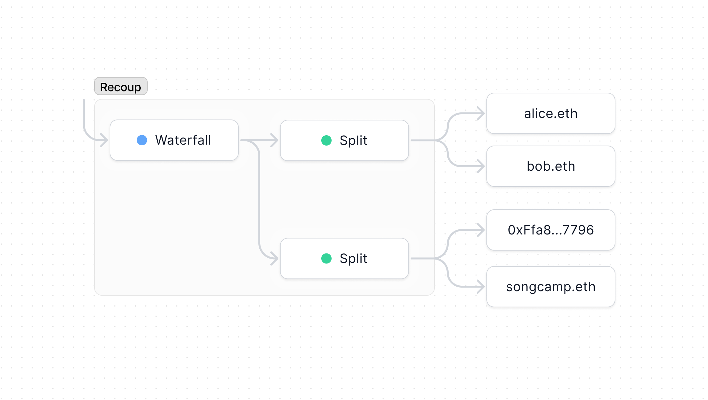

import { Toggle } from '../../components/toggle'
import { Tab, Tabs } from 'nextra-theme-docs'

# Recoup

The Recoup template allows you to split profits instead of revenue. By creating
a [Waterfall](/core/waterfall) that points to a number of [Splits](/core/split),
it makes it easy to repay one group before splitting profits with another.

- [Creation form](https://app.splits.org/new/recoup/)
- [Contracts & NatSpec](https://github.com/0xSplits/splits-recoup/tree/main/src)
- [Github](https://github.com/0xSplits/splits-recoup)
- [SDK](/sdk/templates)
- [Example](https://app.splits.org/accounts/0x0bb7a1B75Ac3e679d77E5336fDEBcFe95E89cEED/)

## How It Works

- We recommend familiarizing yourself with how [Waterfall](/core/waterfall) and
  [Split](/core/split) work, since Recoup is just a factory to make it easier to
  deploy those building blocks composed together in a single transaction.
- Any non-target tokens sent to the Recoup will be recovered to the final tier
  (i.e., the profit share tier).
- This contract was not designed for a large number of tranches and shouldn't be
  used with more than 1,000.

## Addresses

<Tabs items={['Mainnets', 'Testnets']}>

<Tab>

<Toggle title="Ethereum - 1">

| Contract | Address                                                                                                                      |
| :------- | :--------------------------------------------------------------------------------------------------------------------------- |
| Recoup   | [`0xCbB386B801Ec72A5aB02AEB723dECd12f96EdE41`](https://etherscan.io/address/0xCbB386B801Ec72A5aB02AEB723dECd12f96EdE41#code) |

</Toggle>

<Toggle title="Optimism – 10">

| Contract | Address                                                                                                                                 |
| :------- | :-------------------------------------------------------------------------------------------------------------------------------------- |
| Recoup   | [`0xCbB386B801Ec72A5aB02AEB723dECd12f96EdE41`](https://optimistic.etherscan.io/address/0xCbB386B801Ec72A5aB02AEB723dECd12f96EdE41#code) |

</Toggle>

<Toggle title="BSC – 56">

| Contract | Address                                                                                                                     |
| :------- | :-------------------------------------------------------------------------------------------------------------------------- |
| Recoup   | [`0x5ff0C88311F79803B43e9Dc3F2B20F49A6b680fd`](https://bscscan.com/address/0x5ff0C88311F79803B43e9Dc3F2B20F49A6b680fd#code) |

</Toggle>

<Toggle title="Gnosis – 100">

| Contract | Address                                                                                                                       |
| :------- | :---------------------------------------------------------------------------------------------------------------------------- |
| Recoup   | [`0xCbB386B801Ec72A5aB02AEB723dECd12f96EdE41`](https://gnosisscan.io/address/0xCbB386B801Ec72A5aB02AEB723dECd12f96EdE41#code) |

</Toggle>

<Toggle title="Polygon – 137">

| Contract | Address                                                                                                                         |
| :------- | :------------------------------------------------------------------------------------------------------------------------------ |
| Recoup   | [`0xCbB386B801Ec72A5aB02AEB723dECd12f96EdE41`](https://polygonscan.com/address/0xCbB386B801Ec72A5aB02AEB723dECd12f96EdE41#code) |

</Toggle>

<Toggle title="Fantom – 250">

| Contract | Address                                                                                                                     |
| :------- | :-------------------------------------------------------------------------------------------------------------------------- |
| Recoup   | [`0xCbB386B801Ec72A5aB02AEB723dECd12f96EdE41`](https://ftmscan.com/address/0xCbB386B801Ec72A5aB02AEB723dECd12f96EdE41#code) |

</Toggle>

<Toggle title="Base – 8453">

| Contract | Address                                                                                                                      |
| :------- | :--------------------------------------------------------------------------------------------------------------------------- |
| Recoup   | [`0xCbB386B801Ec72A5aB02AEB723dECd12f96EdE41`](https://basescan.org/address/0xCbB386B801Ec72A5aB02AEB723dECd12f96EdE41#code) |

</Toggle>

<Toggle title="Arbitrum – 42161">

| Contract | Address                                                                                                                     |
| :------- | :-------------------------------------------------------------------------------------------------------------------------- |
| Recoup   | [`0xCbB386B801Ec72A5aB02AEB723dECd12f96EdE41`](https://arbiscan.io/address/0xCbB386B801Ec72A5aB02AEB723dECd12f96EdE41#code) |

</Toggle>

<Toggle title="Avalanche – 43114">

| Contract | Address                                                                                                                      |
| :------- | :--------------------------------------------------------------------------------------------------------------------------- |
| Recoup   | [`0xCbB386B801Ec72A5aB02AEB723dECd12f96EdE41`](https://snowtrace.io/address/0xCbB386B801Ec72A5aB02AEB723dECd12f96EdE41#code) |

</Toggle>

<Toggle title="Zora – 7777777">

| Contract | Address                                                                                                                                      |
| :------- | :------------------------------------------------------------------------------------------------------------------------------------------- |
| Recoup   | [`0xCbB386B801Ec72A5aB02AEB723dECd12f96EdE41`](https://explorer.zora.energy/address/0xCbB386B801Ec72A5aB02AEB723dECd12f96EdE41?tab=contract) |

</Toggle>

<Toggle title="Aurora – 1313161554">

| Contract | Address                                                                                                                        |
| :------- | :----------------------------------------------------------------------------------------------------------------------------- |
| Recoup   | [`0xCbB386B801Ec72A5aB02AEB723dECd12f96EdE41`](https://aurorascan.dev/address/0xCbB386B801Ec72A5aB02AEB723dECd12f96EdE41#code) |

</Toggle>

</Tab>

<Tab>

<Toggle title="Goerli - 5">

| Contract | Address                                                                                                                             |
| :------- | :---------------------------------------------------------------------------------------------------------------------------------- |
| Recoup   | [`0xCbB386B801Ec72A5aB02AEB723dECd12f96EdE41`](https://goerli.etherscan.io/address/0xCbB386B801Ec72A5aB02AEB723dECd12f96EdE41#code) |

</Toggle>

<Toggle title="Holesky - 17000">

| Contract | Address                                                                                                                              |
| :------- | :----------------------------------------------------------------------------------------------------------------------------------- |
| Recoup   | [`0xcFba37C5Ee4d80c286593342470EB881deb9799e`](https://holesky.etherscan.io/address/0xcFba37C5Ee4d80c286593342470EB881deb9799e#code) |

</Toggle>

<Toggle title="Sepolia - 11155111">

| Contract | Address                                                                                                                              |
| :------- | :----------------------------------------------------------------------------------------------------------------------------------- |
| Recoup   | [`0x8Cbb4e187ce8A29BACC13Fd999a107f3c4b46D3B`](https://sepolia.etherscan.io/address/0x8Cbb4e187ce8A29BACC13Fd999a107f3c4b46D3B#code) |

</Toggle>

<Toggle title="BSC Testnet – 97">

| Contract | Address                                                                                                                             |
| :------- | :---------------------------------------------------------------------------------------------------------------------------------- |
| Recoup   | [`0x5ff0C88311F79803B43e9Dc3F2B20F49A6b680fd`](https://testnet.bscscan.com/address/0x5ff0C88311F79803B43e9Dc3F2B20F49A6b680fd#code) |

</Toggle>

<Toggle title="Optimism Goerli – 420">

| Contract | Address                                                                                                                                      |
| :------- | :------------------------------------------------------------------------------------------------------------------------------------------- |
| Recoup   | [`0xCbB386B801Ec72A5aB02AEB723dECd12f96EdE41`](https://goerli-optimism.etherscan.io/address/0xCbB386B801Ec72A5aB02AEB723dECd12f96EdE41#code) |

</Toggle>

<Toggle title="Fantom Testnet – 4002">

| Contract | Address                                                                                                                             |
| :------- | :---------------------------------------------------------------------------------------------------------------------------------- |
| Recoup   | [`0xCbB386B801Ec72A5aB02AEB723dECd12f96EdE41`](https://testnet.ftmscan.com/address/0xCbB386B801Ec72A5aB02AEB723dECd12f96EdE41#code) |

</Toggle>

<Toggle title="Gnosis Chiado – 10200">

| Contract | Address                                                                                                                                                        |
| :------- | :------------------------------------------------------------------------------------------------------------------------------------------------------------- |
| Recoup   | [`0xCbB386B801Ec72A5aB02AEB723dECd12f96EdE41`](https://blockscout.com/gnosis/chiado/address/0xCbB386B801Ec72A5aB02AEB723dECd12f96EdE41/contracts#address-tabs) |

</Toggle>

<Toggle title="Avalanche Fuji – 43113">

| Contract | Address                                                                                                                              |
| :------- | :----------------------------------------------------------------------------------------------------------------------------------- |
| Recoup   | [`0xCbB386B801Ec72A5aB02AEB723dECd12f96EdE41`](https://testnet.snowtrace.io/address/0xCbB386B801Ec72A5aB02AEB723dECd12f96EdE41#code) |

</Toggle>

<Toggle title="Polygon Mumbai – 80001">

| Contract | Address                                                                                                                                |
| :------- | :------------------------------------------------------------------------------------------------------------------------------------- |
| Recoup   | [`0xCbB386B801Ec72A5aB02AEB723dECd12f96EdE41`](https://mumbai.polygonscan.com/address/0xCbB386B801Ec72A5aB02AEB723dECd12f96EdE41#code) |

</Toggle>

<Toggle title="Arbitrum Goerli – 421613">

| Contract | Address                                                                                                                                                              |
| :------- | :------------------------------------------------------------------------------------------------------------------------------------------------------------------- |
| Recoup   | [`0xCbB386B801Ec72A5aB02AEB723dECd12f96EdE41`](https://goerli-rollup-explorer.arbitrum.io/address/0xCbB386B801Ec72A5aB02AEB723dECd12f96EdE41/contracts#address-tabs) |

</Toggle>

<Toggle title="Aurora Testnet – 1313161555">

| Contract | Address                                                                                                                                |
| :------- | :------------------------------------------------------------------------------------------------------------------------------------- |
| Recoup   | [`0xCbB386B801Ec72A5aB02AEB723dECd12f96EdE41`](https://testnet.aurorascan.dev/address/0xCbB386B801Ec72A5aB02AEB723dECd12f96EdE41#code) |

</Toggle>

</Tab>

</Tabs>
