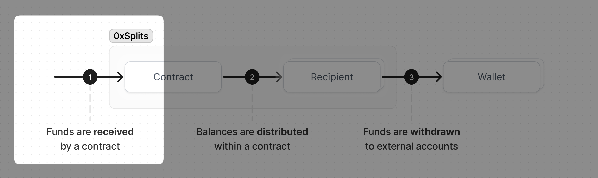
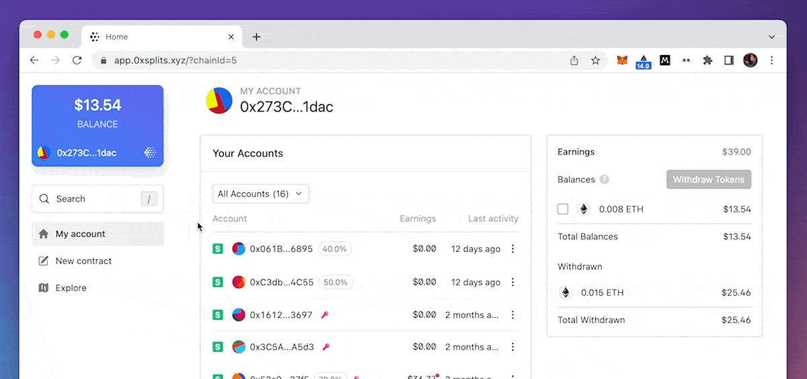

import { Callout } from 'nextra-theme-docs'

# Sending funds

This section covers how to use the contracts anywhere you want to split onchain
payments.

<Callout type="warning">
  All of these contracts can only distribute ETH and ERC20s. **Do not send
  NFTs**.
</Callout>

### Locating the address

The first thing to do is locate the contract address. Remember that each
contract has a unique address at which it can receive ETH and ERC20 tokens. The
address is displayed in two places in the app.

The first is in the header of the contract detail page. Hovering over it will
reveal the full address, and clicking on it will copy it to your clipboard.

The second place is in the URL of the page itself. It is the text after
`/accounts/` that begins with `0x`.

Funds can be sent to this address from any exchange, marketplace, wallet, or
smart contract. Just paste in your contract's address anytime you want funds
split according to the rules of the contract.

### Locating your contracts

To find all the contracts you're part of, either connect your wallet and
navigate to the "My account page", or search for your ENS/address. Within the
accounts section, click on the filter dropdown and select "Earning from". You
can also filter by contracts you control, your bookmarks, different contract
types, and more.

If you're having trouble locating specific contracts or accounts, double check
the network you're viewing or the wallet you're connected to. Drop us a note in
the `user-support` channel in [Discord](https://chat.0xsplits.xyz/) if you're
still having trouble.

## Other platforms

All the contracts are designed to be used with other platforms within the
Ethereum ecosystem. Below are a few places where people are using them today.
Remember that **all you have to do is paste your contract address into the
payout field**.

<Callout>
  Splitting revenue from primary sales? Check out [this
  guide](https://mirror.xyz/iamkabuki.eth/CKikAuMK71sdfrfDb5qUb-Hwp-PwbhC0v2muIUyCcm0)
  on using 0xSplits + Manifold + Zora.
</Callout>

### OpenSea

When creating a collection on OpenSea, you can add creator earnings (i.e.
royalties) and specify the address to which the earnings will be sent. OpenSea’s
instructions are
[here](https://support.opensea.io/hc/en-us/articles/1500009575482-How-do-creator-earnings-work-on-OpenSea-).
Just paste in your contract's address into the "Creator Earnings" section. Note:
you can split Creator Earnings directly on OpenSea, however, since OS uses a
push model this makes it
[more expensive](https://support.opensea.io/hc/en-us/articles/1500011590241-What-are-service-and-creator-fees-#:~:text=Splitting%20creator%20fees)
for the buyer each time your NFT is sold.

At this time, OpenSea does not allow setting a Creator Earnings for an
individual item. Creator Earnings can
[only be added](https://support.opensea.io/hc/en-us/articles/1500011590241-What-are-service-and-creator-fees-#:~:text=at%20any%20time.-,Creator%20fees,-Creators%20can%20set)
at the Collection level. In the future, we hope to see more platforms follow
[Zora’s approach](https://zine.zora.co/zora-v3) in letting creators specify a
“funds recipient” field on a per-item basis.

### Zora

Zora’s [V3 contracts](https://zine.zora.co/zora-v3) allow for developers to
specify a “seller funds recipient”. This is the address that funds are sent to
when the NFT is sold. All you have to do is set the
[`sellerFundsRecipient`](https://docs.zora.co/docs/smart-contracts/modules/Asks/zora-v3-asks-v1.1#ask-structure)
to be your contract's address. You can find more about using 0xSplits in Zora's
FAQs
[here](https://support.zora.co/en/articles/6898708-how-do-i-use-a-split-contract-with-my-collection).

### Foundation

While creating a NFT on Foundation, creators can optionally split earnings for
that NFT with up to three other addresses natively through Foundation.
Instructions are
[here](https://help.foundation.app/hc/en-us/articles/4513530159131-Splitting-Earnings-on-an-NFT).
Using 0xSplits within Foundation is easy – just paste your contract's address
into the recipient field while creating a Foundation split.

Why use 0xSplits within Foundation? Though conceptually they may seem similar,
functionally 0xSplits and Foundation splits are quite different.

- 0xSplits have mutability, allowing you to change the recipients & percentages
  in the future without having to mint a new NFT contract.
- 0xSplits are not tied to any one particular NFT contract or platform. They can
  be reused again and again across any platform. This means you can use the
  exact same Split on OpenSea, Zora, Foundation, Manifold, etc.
- 0xSplits allow for up to ~500 recipients, whereas Foundation limits you to 4
  recipients (including yourself). This is because on Foundation the split logic
  happens each time the NFT is sold, passing on that cost to the buyer.
- 0xSplits splitting logic is batched & exists as a standalone function that is
  handled by bots/third parties. The cost of splitting on Foundation is paid for
  by the buyer each time the NFT changes hands.

All this is not to say 0xSplits is better than Foundation splits! They're very
different and were each designed with different constraints in mind. The best
tool for the job depends on the job itself. We encourage you to learn about the
tradeoffs of each option, and reach out if you have any questions.

### Manifold

Manifold makes it super easy for people to set royalties on their NFT contracts.
Their approach is very similar to Foundation's, and it's worth reading the above
section if you haven't already. You can read Manifold's instructions
[here](https://docs.manifold.xyz/v/manifold-studio/deploying-contracts/royalties).
To use 0xSplits on Manifold, just enter the Split's address in the "Default
Royalties" section.

It's also worth nothing that Manifold allows you to _mint NFTs_, meaning what
you configure on Manifold relates only to _secondary sales_. To split _primary
sales_ revenue from a Manifold NFT, check out
[this guide](https://mirror.xyz/iamkabuki.eth/CKikAuMK71sdfrfDb5qUb-Hwp-PwbhC0v2muIUyCcm0).
