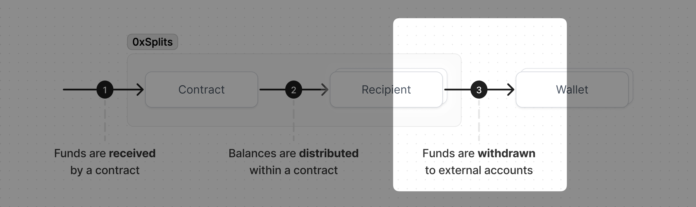

# Withdrawing balances

Withdrawing is the process of transferring a balance from 0xSplits to a
recipient's wallet. Regardless of how many contracts someone earns from, or how
frequently those contracts receive income, it only takes a single transaction to
transfer _all of those balances_ to their wallet. Anyone can do this at their
leisure, whenever gas prices are low or they just want to cash out. Learn more
about this step [here](/flow#withdrawing).

## Withdrawing for yourself

After connecting your wallet you'll see your total balances in USD in the top
left corner of the app. If your balance shows $0.00, that is either because you
have no balances to withdraw or because we're unable to determine a USD price
for your balances. Clicking on your balance will open your account view.

Just select all the balances you wish to withdraw, hit withdraw, and the funds
will be transferred from your balance in 0xSplits to your wallet. If you have
any "pending" balances (i.e., contracts you earn from that have balances waiting
to be distributed), those will show up here as well. You may wish to distribute
those pending balances before withdrawing (or just wait for a bot to distribute
them if there's a bounty!).

You can also select which balances to withdraw by clicking on "My account" in
the sidebar and then looking at the Earnings section on the right.

## Withdrawing for another account

There may be instances when you wish to withdraw on behalf of another account.
When you do this, you're effectively paying the gas needed to "push" the funds
from 0xSplits to their wallet. Anyone can withdraw on behalf of another account
at any time.

To do this, just navigate to the account's detail page (either by searching or
clicking on it from the list of recipients) and in the Earnings section select
the balances you wish to withdraw. Remember that this will transfer these
balances to the _account's address_, not your own. By withdrawing "for" another
account, you're just paying the gas needed to send them their funds.

